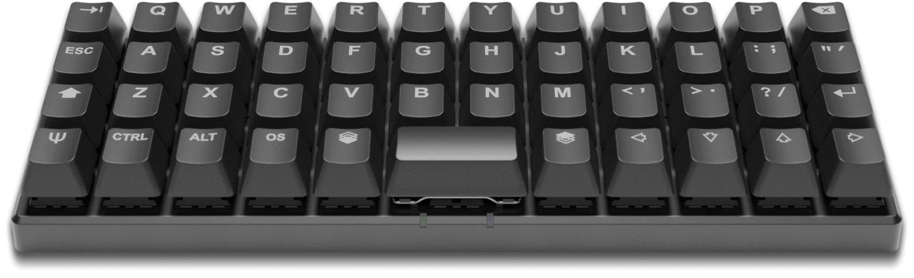

Привет, мой дорогой друг. Я тут на днях пытался понять как делать обзоры на кастомные клавиатуры и решения не пришло. Да и что про них говорить, кастом это то, что вы сами собираете своими руками и тут нельзя все скинуть на производителя. Он не может быть виноват в том, как собрана клавиатура или насколько она шумная. Все это в твоих руках, от того как ты смажешь переключатели до того какой корпус ты выберешь. 

Ладно, раз обзора на конкретную сделать не получится, то давай поговорим про целый ряд особенных клавиатур: сплит-клавиатуры.

## Немного занудства )))

Сплит-клавиатура, исходя из названия, то это разделённая клавиатура, Она обычно состоит из двух частей, то есть наш привычный девайс просто распилили на двое. И говоря про привычный я имею в виду не полноразмерного товарища, а что-то вроде 65-75% собрата 

_Клавиатура Keychron K2_

И в итоге мы получаем вот это 

_[Ultimate Hacking Keyboard 60](https://ultimatehackingkeyboard.com/product/uhk60v2)_

Хотя подожди к борду выше мы еще вернемся, а  пока давай разберемся зачем все это нужно. 

Мы все почти весь день проводим за компьютером и печатаем на то что отдаленно напоминает печатные машинки. Это пришло к нам из прошлого, но принесло проблему будущего в виде [туннельного сидрома](https://ru.wikipedia.org/wiki/%D0%A1%D0%B8%D0%BD%D0%B4%D1%80%D0%BE%D0%BC_%D0%B7%D0%B0%D0%BF%D1%8F%D1%81%D1%82%D0%BD%D0%BE%D0%B3%D0%BE_%D0%BA%D0%B0%D0%BD%D0%B0%D0%BB%D0%B0). Люди подумали и решили что это из-за неправильной постановки рук при печати. И корпорации предложили в это:

_Microsoft Ergonomic_

Есть конечно же решения и от других компаний, но они достаточно большие и местами не очень удобны. Хотя для людей с больными руками это наверно единственное решение, которое уменьшает болевой синдром.  

Второй момент которого хочется коснуться, раз уж мы заговорили про эргономику это расположение клавиш. Если ты обратишь внимание на свою клавиатуру, то скорее всего расположены с неким смещением.

Это тоже отголоски прошлого и той старой печатной машинки. Да работать можно и большинство используют именно этот подход и не жалуются))) 

В современном мире эту проблему исправили и появились ортолинейные клавиатуры. Это позволяет пальцам работать более нативно, то есть просто вверх и вниз без дополнительного движения по диагонали.

Конечно такие решения удел энтузиастов, но тебе надо знать об этом возможно это будет твой идеал для работы. Вот к примеру такая красавица: 

_[Planck EZ](https://www.zsa.io/planck)_

## Ultimate Hacking Keyboard

А теперь возвращаемся к той клавиатуре. Надеюсь у меня получится написать полноценный обзор на это творение. А сейчас кратно. Разделенная клавиатура 60% формата. На выбор вам предлагается 8 видов свитчей от kailh, несколько цветов корпуса. Hot-swap сокеты, то есть можно поставить любые переключатели без пайки. Доступно программное обеспечение для программирования клавиатуры. Дополнительно можно докупить подставки под запястья, но главная особенность это дополнительные блоки под большие пальцы. Они позволяют расширить возможности этой клавы.

Стоимость достаточно высокая - $300 за клавиатуру без допов.
Купить можно [тут](https://ultimatehackingkeyboard.com/)

## ErgoDox EZ, MoonLander mark 1

Еще две клавиатуры от одного производителя. Полный обзор будет позже. А сейчас быстро. 
Ортолинейные клавы с подсветкой. Обе обладают hot-swap, несколько переключателей на выбор от Cherry и Kailh. Есть программное обеспечение для настройки под себя. 

_ErgoDox EZ_

Купить можно [тут](https://ergodox-ez.com/) Цена начинается от $280 и до $360, Подставки и ножки покупаются отдельно, также есть опции без подсветки. 

_MoonLander_

Цена около $300, но все идет в комплекте. Купить можно [тут](https://www.zsa.io/moonlander/) 

Если не хочется тратить много денег на ErgoDox, то можно купить аналог на AliExpress: [ErgoDone](https://aliexpress.ru/item/32830050940.html). 
Правда там продается DIY KIT так что придется паять, но зато цена гораздо ниже. Сам проект открытый так что для программирования клавиатуры можно использовать [QMK](/posts/chto-takoe-qmk/) или другие решения. Это будет настоящая кастомная клавиатура которую вы соберете сами. У меня этот конструктор стоит дома, так что как доберусь до него и соберу его, расскажу обо всем тут. 

## Corne

Клавиатура для энтузиастов, тут нет полностью готового решения. Ты сам все выбираешь.
Это открытый проект на [github](https://github.com/foostan/crkbd). Тут можно найти схемы платы и заказать и в китае, купить микроконтроллер, диоды и собрать все что хочешь. Борд поддерживает [QMK](/posts/chto-takoe-qmk/) и ZMK для беспроводного решения (правда нужны контроллер с поддержкой bluetooth). 
Раскладка правда полностью не покрывает кириллицу, так что придется пользоваться слоями. Слои для сплит клавиатур это нормальное дело, ты сам пользуешься  слоем для получения прописных символов. Тут ты будешь на слои выносить все, стрелки, цифры и доп клапвиши, но ты если перешел на разделенные клавиатуры то слои для тебя мелочи. Купить можно как и на авито, так и заказать из забугорного магазина к примеру [тут](https://keyhive.xyz/corne) или [тут](https://www.littlekeyboards.com/) 

_Corne Keyboard_

## Lily58 Pro, Sofle, Iris

Эти проекты такие же как и corne, но клавиш тут больше. А все остальное так же как и у corne.
Купить можно на Авито, так и  [тут](https://www.littlekeyboards.com/) 

Проект на [github для lily58](https://github.com/kata0510/Lily58)

_Lily58_

Проект на [github для Sofle](https://github.com/josefadamcik/SofleKeyboard)

_Sofle_

Iris купить можно [тут](https://keeb.io/collections/iris-split-ergonomic-keyboard) 

## Итоги 

Я рассказал далеко не все об этом классе клавиатур. Их очень много как от энтузиастов, так и от больших компаний. [Тут](https://github.com/diimdeep/awesome-split-keyboards) можно найти различные open source решения, а можно придумать все самому благо клавиатура не настолько сложный девайс. 

Заканчивая пост о разделенных клавиатурах и эргономике хочется вспомнить еще один девайс у которого даже есть педали для ног. Из-за своего футуристического дизайна он засветился в фильме "Люди в черном" и это:

_Kinesis Advantage_

Но о нем позже. 