Привет. Еще одна бюджетная клавиатура попала ко мне в руки. За цену около 3000 рублей мы получаем хот-свап сокеты, RGB подсветку и 60 процентный форм-фактор. Давайте посмотрим все ли тут так хорошо или за эту цену получить что-то сносное тяжело.

## Знакомство

Называется данное творение _*Redragon k617 Fizz*_ и доступно в нескольких цветах:

- Черная

  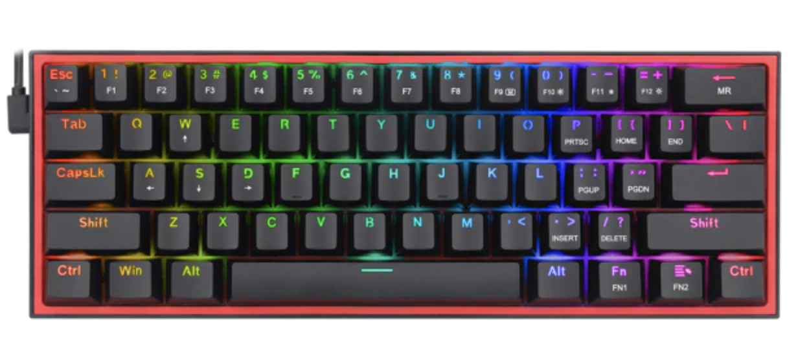

- Бело-серая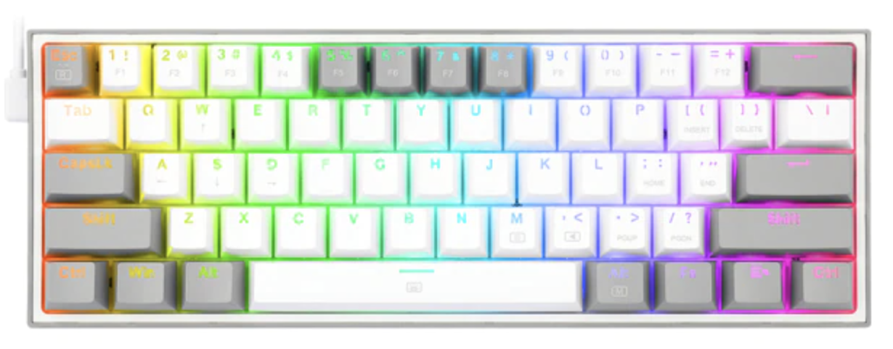

- Серо-белая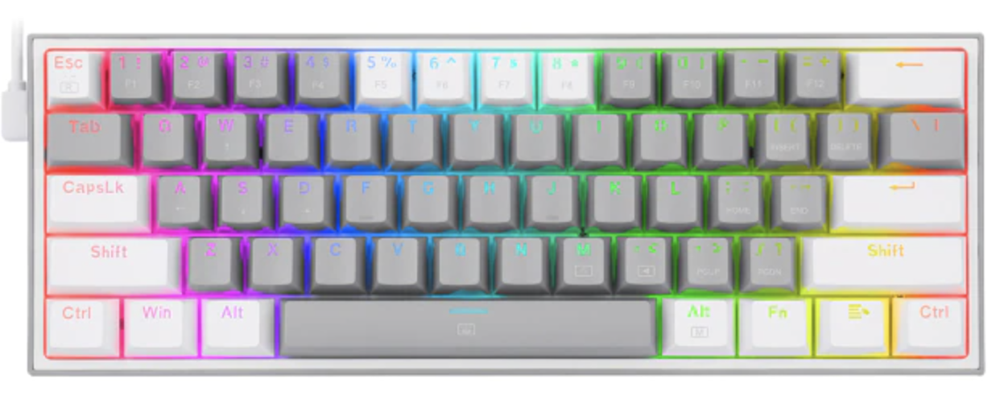

- Розово-белая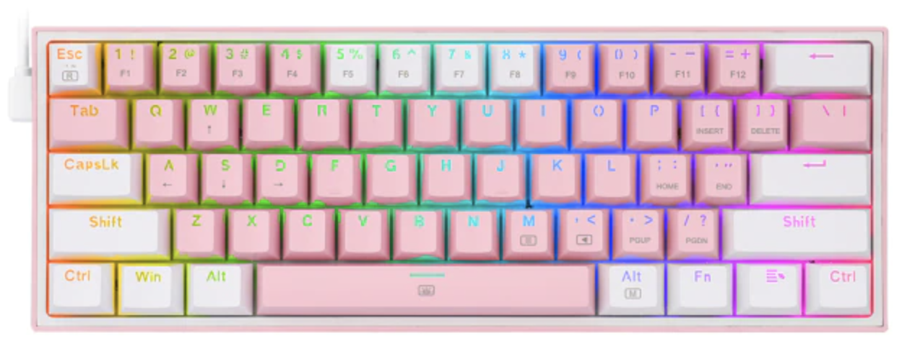

- Бело-розовая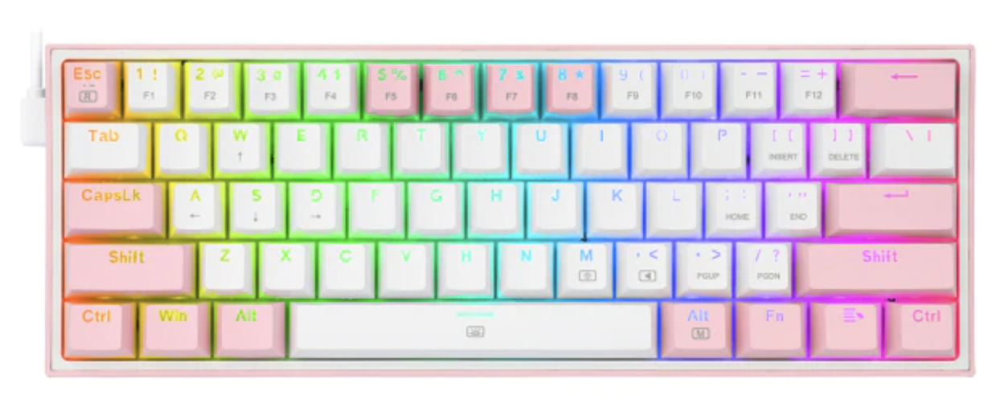

Дополнительно для черной версии можно заказать кейкапы с кириллицей. Комплект поставки меня порадовал. Так как за такую небольшую цену ты не ждешь чего-то интересного. В коробке я нашел:

- Клавиатура
- Кабель USB
- Инструкция на английском
- Наклейка с логотипом
- 5 дополнительных переключателей
- Пуллер-скоба для переключателей
- Пластиковый пуллер для кейкапов

Правда, достаточно хороший набор за такие деньги. Вот только красный пластиковый пуллер лучше выбросить. Он будет царапать и красить ваши кейкапы, так что покупайте отдельно проволочный. Такого добра за вменяемые деньги можно без труда найти на Али.

Формат клавиатуры 60 процентов, что является одним из популярных компактных решений. Тут нет блока с цифрами, F-клавиш и стрелок. Точнее все это есть, но через дополнительную Fn клавишу. Для меня такой размер борда идеален, но кому-то может показаться маловато.

Тип строения клавиатуры закрытый, то есть боковые стенки корпуса закрывают основание переключателя. Общий дизайн приятный, минималистичный и выглядит дороже своей цены.

## Хот-свап

Это наверно самое интересное в клавиатуре, тут легко без пайки можно заменить переключатели на любые механические. В отличие от [GK61](/posts/opto-mekhanicheskaya-klaviatura-gk61-s-aliexpress/) таких переключателей на Али или других площадках пруд пруди.

Система хот-свап реализована не совсем стандартным способом, тут нет популярных Kailh сокетов. В клавиатуре использованы Mill-max сокеты, по сути своей, это небольшие воронки которые впаяны в плату. Это более бюджетное решение и сравнивать его с другими, но оно никак не ограничивает вас в работе. 

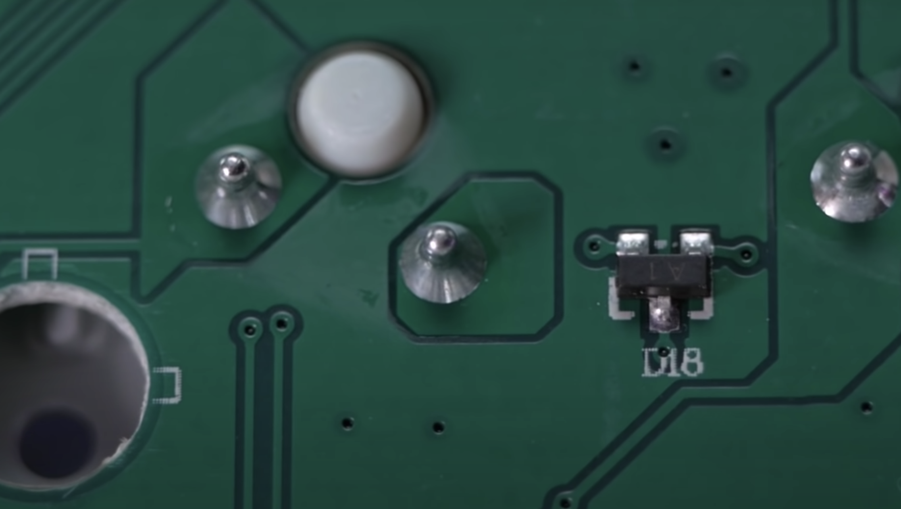

В стоке плата поддерживает 3-пин переключатели, но и 5-пин вы тоже можете сюда вставить, предварительно подрезав лишнюю пару ножек. 

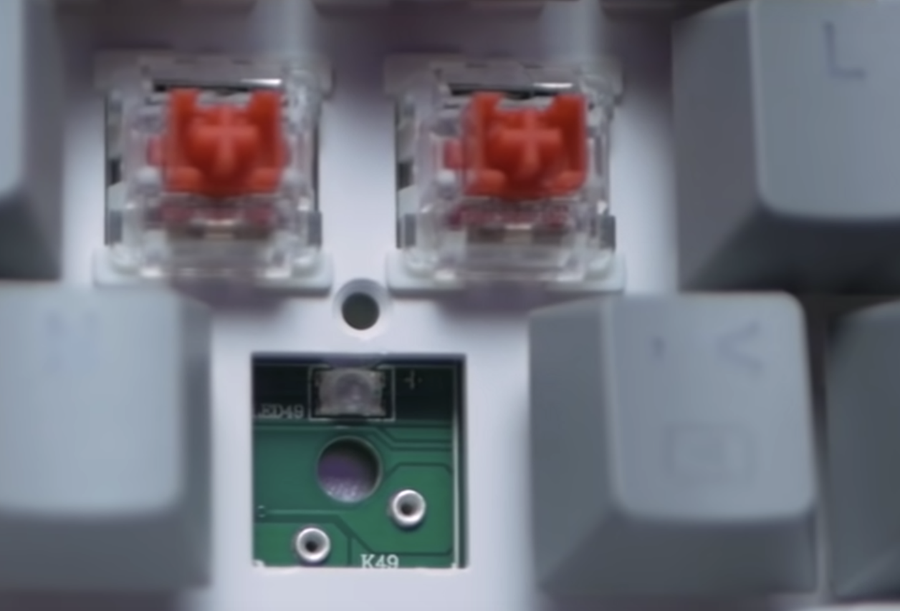

Стоковые переключатели в плате сидят довольно плотно и при вытаскивании вы можете повредить, но в комплекте есть запасные

## Переключатели

Клавиатура приходит с фирменными линейными переключателями redragon с силой нажатия около 60 граммов и заявленным ресурсом в 50 миллионов нажатий.

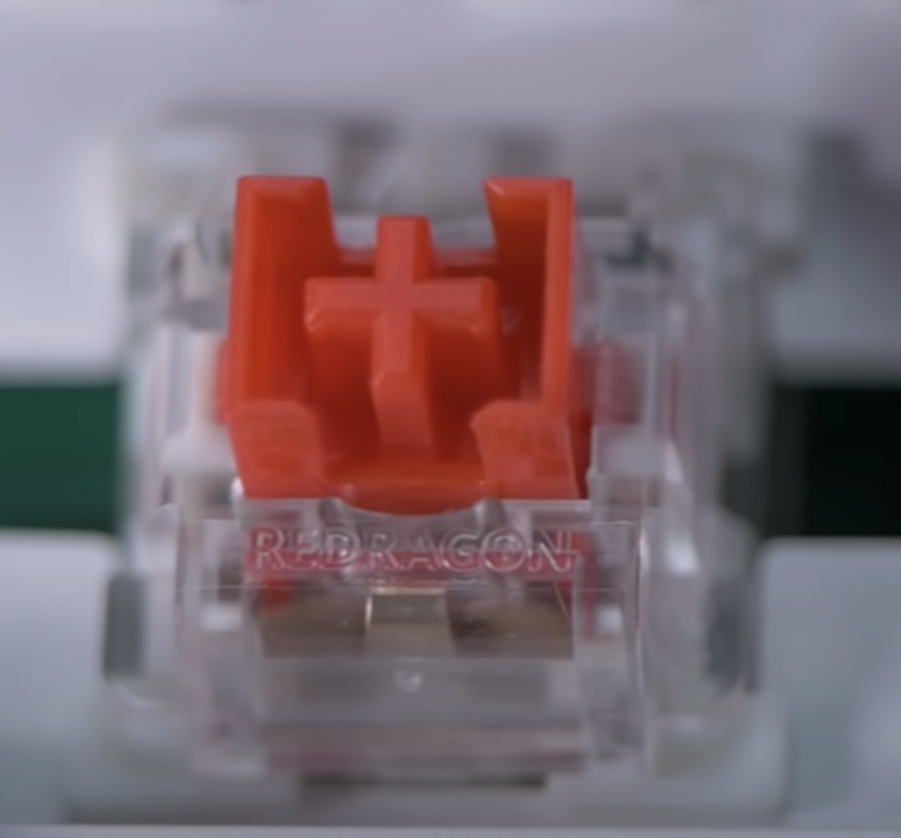

Стэм переключателя имеет вид как Kailh Box, но это единственное сходство. Сами переключатели имеют люфт и временами звук пружины. Эффекта песка в них не наблюдалось. Лучше их конечно смазать, а в идеале заменить. Благо такую возможность клавиатура предоставляет.

Кейкапы тут красивые и отлично смотрятся, правда качество страдает, Это простой ABS пластик толщиной меньше одного миллиметра. Профиль OEM, символы нанесены при помощи double-shot технологии, что позволит символам отображаться до конца жизни кейкапа.

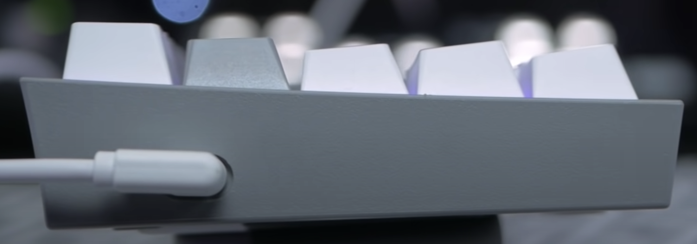

Стабилизаторы тут белые plate mount и они даже смазаны, но смазки очень мало. Лучше их смазать или заменить.

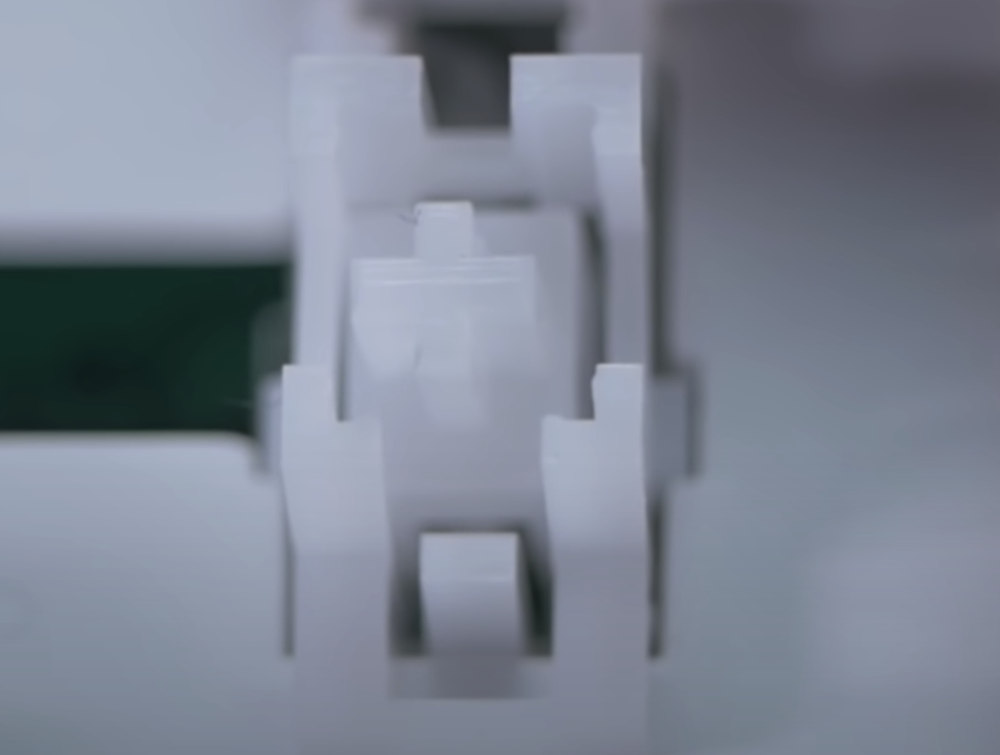

## Корпус

Металла в корпусе вы не найдете, да и что ожидать за такую цену. Сам корпус не скручивается, наверно из-за того, что пластика много. Главный минус это пластиковый плэйт.

Шумки в корпусе вы тоже не найдете, но я думаю что это не проблема. Вы можете проложить 5 миллиметровую шумку с Али или с авторынка.

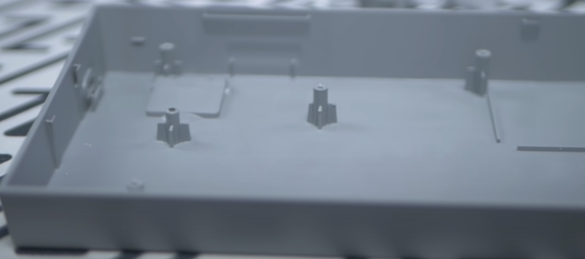

Снизу находятся прорезиненые ножки. Есть выдвижные, которые тоже с резиной. Правда клавиатура легкая и резина на ножках не спасает.

Слева расположился разъем USB и с Г-образным кабелем это очень удобное решение.

## Софт

Программное обеспечение имеется. Оно простое, но позволяет настроить все, что вам необходимо:

- Раскладку

- Подсветку

- Макросы

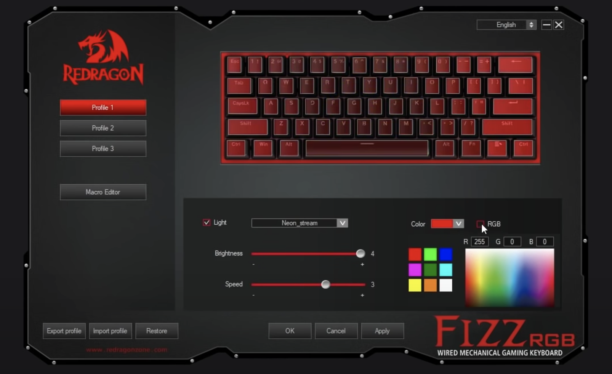

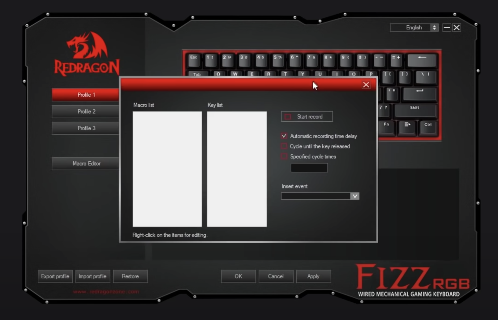

Подсветка полностью RGB и диоды установлены на северной части разъема.

## Итог

За такую цену очень годная клавиатура и наверно стоит покупать.

Из минусов:

- полностью пластиковый плейт
- некачественные кейкапы
- посредственные переключатели

Все, кроме плейта можно заменить, добавить шумку и получится неплохая клавиатура начального уровня.

Так что если это первая клавиатура или бюджет ограничен, то можно смело покупать. Ссылка на [Али](https://s.click.aliexpress.com/e/_AF96oo).

 

 
