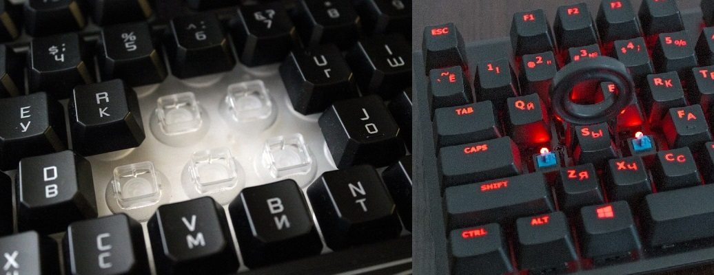

Вопрос о выборе клавиатуры остро стоит перед каждым активным пользователем компьютера. В магазинах представлен огромный ассортимент игровых/рабочих/бюджетных устройств, однако все они, за редким исключением, изготовлены по одной технологии — мембранной.

Механические клавиатуры давно представлены на российском рынке, но до сих пор для среднестатистического покупателя являются чем-то излишне дорогим и непонятным.

Расскажем кратко про основные отличия механической конструкции от мембранной, чтобы вы поняли, о чем идет речь.

## ТЕХНИЧЕСКИЕ ОТЛИЧИЯ МЕХАНИЧЕСКОЙ КЛАВИАТУРЫ ОТ МЕМБРАННОЙ

Мембранная клавиатура представляет собой трехслойную резиновую или силиконовую прокладку, уложенную поверх электронных контактов. По всей поверхности прокладка усеяна выступающими «колпачками», на которые крепятся кнопки с пластиковым стержнем. Срабатывание клавиши происходит, когда стержень продавливает мембрану до контактов, т.е. необходимо полное нажатие.

В механической клавиатуре каждая клавиша оснащена индивидуальным механизмом переключения, который срабатывает примерно на середине хода кнопки.

Однако термины «мембрана», «ход клавиши», «механизм переключения» не помогут сделать выбор обычному пользователю. Максимум, вы сможете внешне отличать разные виды девайсов.

## РЕАЛЬНАЯ РАЗНИЦА МЕЖДУ МЕХАНИЧЕСКИМИ И МЕМБРАННЫМИ КЛАВИАТУРАМИ

Если вы подходите к компьютеру раз в день посмотреть сериал или посидеть в соцсетях, то кардинальной разницы между механическими и мембранными устройствами нет. Это как купить Ferrari, чтобы ездить раз в неделю на дачу.

А вот если ваша работа или хобби тесно связаны с работой за компьютером, то покупка механической клавиатуры станет лучшим вложением денег. На это есть несколько причин:

-   Долговечность. Срок службы клавиатуры измеряется не в годах, а в количестве нажатий. Для мембранной клавиатуры это 5−10 миллионов нажатий, а для механической — 50 миллионов.
-   Возможность подобрать устройство под свой стиль печати. Кому-то нравится с силой прожимать клавиши, кому-то легонько порхать пальцами над клавиатурой — для любого пользователя найдется свой тип переключателей.
-   Гарантированное срабатывание клавиш. Необходимость до конца прожимать кнопки при работе на мембранной клавиатуре приводит к тому, что при быстрой печати часть нажатий не срабатывает. Результат — опечатки, которые можно и не заметить.
-   Забота о здоровье. Постоянная работа с компьютером приводит к возникновению туннельного синдрома. Механическая клавиатура требует прикладывать меньше усилий при печати, поэтому руки не устают.

Теперь мы можем вернуться к вопросу в заголовке статьи. Какая клавиатура лучше: механическая или мембранная? Ответ — механическая, если:

-   Вы проводите за компьютером (а точнее, за печатью) большую часть дня.
-   Вас не смущает громкое клацанье клавиш (многим это, наоборот, нравится). Мембранные клавиатуры звучат намного тише механических, потому что резина и силикон хорошо амортизируют.
-   Вы можете себе ее позволить. Цены на качественные механические клавиатуры начинаются от 7000 рублей.