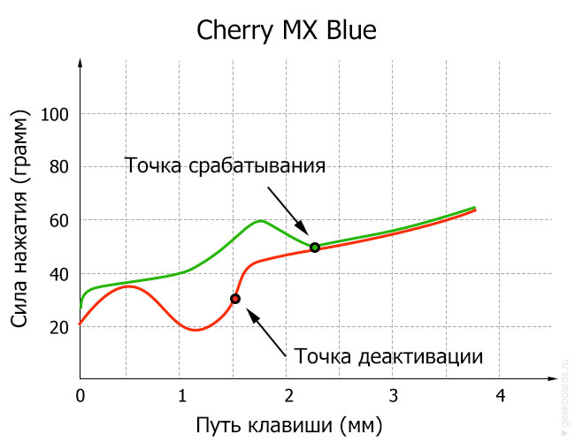
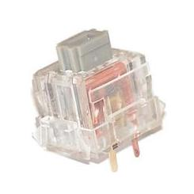
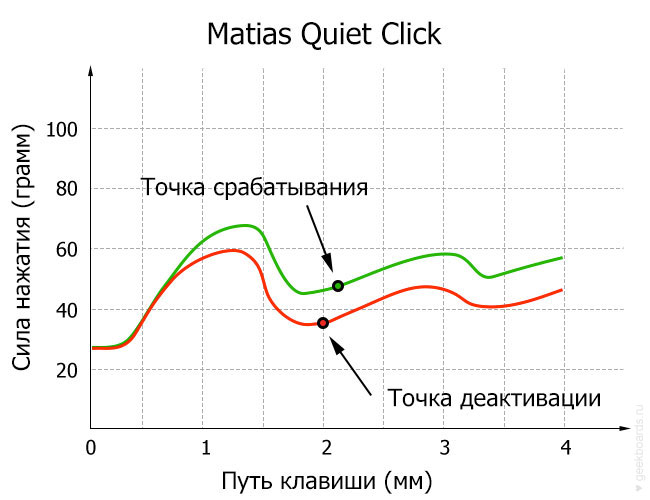

В механических клавиатурах чаще всего используются переключатели превосходного качества Cherry MX и Topre. Они отличаются исключительно долгим сроком службы – до 80 000 часов активного использования, что равнозначно 50 миллионам нажатий. Получается, что такой переключатель теоретически прослужит вам примерно 6,5 лет, если вы на протяжении всего этого времени будете круглыми сутками непрерывно печатать со скоростью 200 знаков в минуту. А фактически он может служить не одно десятилетие.

Существует множество типов переключателей, но наиболее популярные это Cherry MX и Topre.

## ПЕРЕКЛЮЧАТЕЛИ CHERRY MX

Впервые представлены 7 ноября 1983 года немецкой компанией Cherry. Изначально были доступны только линейные переключатели. Впоследствии разнообразие переключателей достигалось за счет комбинирования силы нажатия, наличия или отсутствия тактильной отдачи и наличия/отсутствия клика. Визуально переключатели различаются по цветам штока (stem color).

Переключатели Cherry MX фактически являются стандартом качества в индустрии. Позолоченные контакты не окисляются со временем, их можно полить кофе, колой и другим напитком на выбор, затем промыть под проточной водой, хорошо высушить и использовать дальше.

При производстве особое внимание уделяют точности и аккуратности, что позволяет избежать отказов, поломок, даблкликов, дребезжания и других неприятных особенностей, встречающихся в дешевых китайских клонах.

### ПЕРЕКЛЮЧАТЕЛИ CHERRY MX RGB

В 2014 году была представлена версия RGB с прозрачным корпусом. Переключатели разрабатывались совместно компанией Corsair и Cherry в рамках проекта по созданию полноцветной подсветки клавиатур. После реализации Corsair первые полгода обладала эксклюзивным правом выпускать клавиатуру с этими переключателями. Принцип работы довольно простой: на печатную плату распаивается диод, а благодаря прозрачному и рассеивающему свет корпусу, свет проникает непосредственно под клавишу и освещает пространство вокруг:

### CHERRY MX BROWN (ТАКТИЛЬНЫЕ)

Считаются универсальными переключателями: достаточно тихие по сравнению с Cherry MX Blue и Cherry MX Green, потому что не кликают, но в то же время достаточно хорошо чувствуется точка срабатывания: несложно определить, когда пора отпускать клавишу, не выжимая ее полностью. Эта особенность порадует тех, кто много работает с текстом. Так что если вы точно не знаете, чего хотите, смело берите Cherry MX Brown.

-   В качестве первой механики
-   Для игр на любительском уровне
-   Домой
-   В офис

### CHERRY MX BLUE (ТАКТИЛЬНЫЕ, КЛИКАЮЩИЕ)

Cherry MX Blue – это любовь многих пользователей механических клавиатур. Своим кликом они напоминают печатную машинку, но клик менее громкий и скрежещущий. Помимо воспоминаний, клик позволяет более ярко ощущать точку срабатывания переключателя, а потому печатать на таких переключателях еще удобнее и приятнее, чем на Cherry MX Brown. К тому же они довольно легкие при нажатии, поэтому пальцы при печати не устают. Но есть и минусы: в оупенспейсе использовать такую клавиатуру вряд ли будет хорошей идеей: клик может раздражать ваших соседей по рабочему пространству. Некоторые считают, что из-за большого расстояния между точками активации/деактивации быстрые частые нажатия могут не всегда обрабатываться, поэтому для игр Cherry MX Blue подходят не очень хорошо. Другие же никаких проблем с частыми кликами не испытывают и считают проблему надуманной, так что, как всегда, все очень субъективно.

-   В кабинет на работу, либо в офис с нераздражительными коллегами
-   Домой, если не разбудите никого ночью
-   Печатнику со стажем
-   Любителям теплых ламповых кликов

### CHERRY MX RED (ЛИНЕЙНЫЕ)

Cherry MX Red нежно любят геймеры. Это самые распространенные переключатели для игр. Они линейные, и это удобно для быстрых многократных нажатий. Еще их довольно легко нажимать, в отличие от Cherry MX Black (45 г против 60 г). Это как плюс так и минус: меньше устают пальцы, но проще случайно нажать ненужную кнопку. Тут уж решать вам: или увеличивать точность нажатий, или качать пальцы.

В целом, Cherry MX Red оставляют ощущение мягкости и плавности, поэтому в них помимо геймеров часто влюбляются все подряд. Работать с ними действительно одно удовольствие: пальцы буквально плывут при печати.

-   Геймерам, у которых устают пальцы, или другие переключатели кажутся тяжеловатыми
-   В оупенспейс на работу, чтобы расслабиться и не слишком мешать коллегам
-   Любителям мягкости и плавности 
-   Домой
-   В офис

  

### CHERRY MX SILENT RED (ЛИНЕЙНЫЕ)

Созданы совместно с фирмой Corsair и анонсированы в 2015 году. Это Cherry MX Red для тех, кому нужна максимальная тишина любой ценой. В отличие от сбалансированных Cherry MX Red, тут мягкости уже избыток: в переключателе установлена звукопоглощающая прокладка, которая глушит звук удара пластика о пластик как при нажатии кнопки, так при отпускании. Из-за этого эффекта некоторые считают, что ощущения от использования довольно невнятные, будто нажимаешь в подушку. Другим, наоборот, нравится такая мягкость. Попробуйте потыкать пальцем в стол, а потом себе в ладонь — поймете, о чем речь. Но у Cherry MX Silent Red есть железное преимущество: они и правда почти бесшумные.

-   В офис, где коллеги особенно раздражительны
-   Домой, где живут люди с очень чутким сном
-   Если хочется чего-нибудь нового и необычного
-   Особенно яростным геймерам, чьи агрессивные нажатия отлично смягчатся этими переключателями

  

### CHERRY MX BLACK (ЛИНЕЙНЫЕ)

Впервые представлены в 1984 году. Одни из старейших механических переключателей. Также они одни из самых тугих в линейке. Частый выбор геймеров. С одной стороны это может оттолкнуть, ведь для срабатывания придется приложить большее, чем обычно, усилие, но с другой стороны такая особенность обеспечивает исключительную точность при работе с клавиатурой, так как случайные нажатия полностью исключены. Еще эта тугость дает приятную отчетливость ощущений, за что многие и любят Cherry MX Black. Особенно много сторонников у этих переключателей среди геймеров: в играх требуются быстрые и точные нажатия в течение небольших отрезков времени, поэтому пальцы не успевают устать. 

-   Геймерам
-   Любителям от души постучать по кнопкам
-   Домой

  

### CHERRY MX CLEAR (ТАКТИЛЬНЫЕ)

 

Довольно редко встречающиеся в природе переключатели. Принцип работы похож на Cherry MX Brown, но с более ярко выраженным тактильным откликом. Отлично подойдут тем, кому яркости ощущений от Cherry MX Brown уже недостаточно, а кликающие не подходят. Однозначно, эти переключатели не для новичков. Cherry MX Clear предпочитают для третьей или четвертой механической клавиатуры, когда уже точно знают, чего хотят. Помимо более явного тактильного отклика, они еще и довольно тугие: 60-80 грамм против 40-60 грамм у Cherry MX Brown, что избавляет от случайных нажатий.

-   Опытным любителям механических клавиатур, желающим попробовать что-то новое
-   Тем, кого не устраивают клики, а тактильность очень нравится
-   Обладателям сильных пальцев
-   Домой
-   В офис

### CHERRY MX GREEN (ТАКТИЛЬНЫЕ, КЛИКАЮЩИЕ)

Как и Cherry MX Clear, Cherry MX Green – довольно редко встречающиеся в природе переключатели. Принцип работы тот же, что и у Cherry MX Blue, только пружина более тугая. Как и в случае с Cherry MX Clear, покупать клавиатуру с зелеными переключателями стоит в двух случаях: тогда, когда вы уверены, что синие переключатели для вас недостаточно упругие и для коллекции, чтобы попробовать что-нибудь новенькое. Плюс таких переключателей, как и в случае с другими тугими вариантами в том, что случайные нажатия тут допустить гораздо сложнее. Очень советуем приобретать к такой клавиатуре шумопоглощающие кольца: будет немного потише.

-   Домой опытному механиководу, где уже никого не удивишь стуком механики
-   Любителям от души постучать клавишами
-   Тем, кто без кликов жить не может 

  

### CHERRY MX SPEED SILVER (ЛИНЕЙНЫЕ)

Представлены в 2015 году. Cherry MX Speed Silver – это те же Cherry MX Red, только с укороченным ходом клавиши. Внутри контакт смазан в той части, которая соприкасается со штоком, за счет чего нажатие ощущается особенно ровным гладким. Позиционируются как самые быстрые (fastest) переключатели Cherry MX. За счет уменьшенного на 40% хода клавиши до срабатывания (1.2 мм против 2 мм в стандартных переключателях) хорошо подходят для геймеров, которым нужна максимально быстрая реакция на нажатие и тех, кому длинный ход обычных переключателей мешает печатать еще быстрее. При использовании и правда ощущаются довольно динамичными.

-   Быстрым геймерам
-   Быстрым печатникам
-   В домашнюю коллекцию
-   В офис

### CHERRY MX NATURE WHITE (ЛИНЕЙНЫЕ)

Впервые были анонсированы в октябре 2015 года в клавиатурах Ducky Shine 5. Основная аудитория этих переключателей – геймеры, для которых Cherry MX Red слишком легко нажимаются, а от Cherry MX Black устают пальцы. Cherry MX Nature White не слишком тяжелые и не слишком легкие, прямо таки золотая середина: 52 грамма до срабатывания, в отличие от красных (45 грамм) и черных (60 грамм). В интернете встречается мнение, что однажды они станут стандартом в мире переключателей для геймеров.

-   Геймерам, которым сложно определиться между Cherry MX Red и Black
-   Давним любителям линейных переключателей
-   Особенно разборчивым в силе нажатия
-   В домашнюю коллекцию
-   В офис

## TOPRE

Переключатели Topre – это электростатические емкостные переключатели от японской компании Topre Corporation. Впервые клавиатура Topre была представлена в 1983 году. У переключателя Topre следующее строение: над выпуклой резиновой прокладкой расположена клавиша, а под ней – коническая стальная пружина; сама пружина, в свою очередь, размещается непосредственно над печатной платой. При том, что такие переключатели являются отдельными составляющими клавиатуры, они монтируются все вместе на единую пластину. Резиновый купол – источник бóльшей части сопротивления и тактильности.

Не стоит беспокоиться, что резиновая прокладка выйдет из строя или потеряет свои свойства, как может произойти у дешевых мембранных клавиатур. Клавиатуры с переключателями Topre служат счастливым обладателям десятилетиями.

К какой категории относятся переключатели Topre? Строение переключателей можно охарактеризовать как «гибридное»: так как в их строение входит резиновая мембрана, однозначно отнести их к «механическим» вроде бы нельзя – возможно, даже термин «полумеханические» не совсем корректен. Однако и «мембранными» их не назовешь – ведь у них есть пружины!

### TOPRE 30G, 45G

 

По ощущениям сперва переключатели Topre производят впечатление улучшенных мембранных переключателей с резиновой прокладкой; затем начинает казаться, что вы работаете с механическими переключателями вроде Cherry MX Red или Alps SKCM Cream Damped. Ход клавиш очень гладкий, и точка тактильности приходится почти на самое начало хода. После ее преодоления сопротивление практически пропадает, из-за чего при эксплуатации клавиши, как правило, выжимаются до упора. Точка срабатывания приходится на середину хода, но вы ее вряд ли почувствуете. При нажатии до упора переключатель издает характерный и звучный «цок!», и при возвращении в исходную позицию звук получается примерно такой же. В целом пользователи сходятся на том, что переключатели Topre работают тише большинства механических переключателей и звучат приятно.

В сочетании с нехваткой тактильной обратной связи это может привести к тому, что непривычные в обращении с ними пользователи будут нажимать на какие-то клавиши случайно. Эта проблема особенно актуальна для клавиатур вроде RealForce, оборудованных переключателями с разными весовыми коэффициентами для разных пальцев.

-   Искушенным пользователям, которые знают чего хотят
-   Для тех, кто очень много работает за клавиатурой
-   В коллекцию
-   В любой офис, даже к раздражительным коллегам
-   Домой

## ALPS SKCL/SKCM

 

Переключатели ALPS для механических клавиатур производились одноименной японской компанией до 1996 года. На текущий момент все переключатели, называющие себя ALPS или Alps, являются разной степени точности копиями тех самых старых ALPS. Оригинальные переключатели часто упоминаются в зарубежных источниках как “Alps Complicated” (сложные), из-за конструкции, состоящей из 10 частей на каждый переключатель. Существовали линейные, тактильные, кликающие и другие варианты переключателей Alps.

Наиболее популярными клонами на данный момент являются переключатели фирмы Matias, конструкция которых сильно упрощена относительно оригинала. Если вы не энтузиаст, то обращать внимания на другие клоны нет смысла.

ALPS (и подобные) могут стать отличной альтернативой переключателям Cherry MX: если вам нравится тактильность и хочется чего-то большего, чем Cherry MX Brown и Cherry MX Clear, то ALPS – то что надо.

Не смотря на то, что переключатели ALPS для механических клавиатур на данный момент уже не выпускаются, при желании и достаточном упорстве можно найти клавиатуры в хорошем состоянии в интернете, например на ebay. 

-   Экспериментаторам
-   Тем, для кого Cherry MX – это “что-то не то”
-   Для расширения кругозора
-   В домашнюю коллекцию

## MATIAS

Одни из самых известных клонов ALPS, устанавливаются в клавиатуры Matias. Собираются в Китае компанией Gaote (Dongguan Gaote Electronics Co., Ltd.). Конструкция переключателей Matias довольно сильно упрощена по сравнению с оригинальными ALPS.

_ALPS_                                                                             

 _Matias_ 

У них полностью прозрачный корпус, который позволяет устанавливать светодиоды непосредственно на плату под переключатель, как в случае с Cherry MX RGB.  

Механические переключатели Matias существуют в трех разновидностях: кликающие (clicky), тактильные (tactile/quiet click) и линейные. Как и в случае с Cherry MX, визуально типы переключателей различаются по цветам штока. 

По ощущениям они туже и ярче чем Cherry MX: для нажатия требуется больше усилий, однако тактильная отдача и клик значительно более яркие и сильнее ощущаются (как если сравнивать Cherry MX Brown и Cherry MX Clear). Некоторые говорят, что после Matias все Cherry MX кажутся почти линейными :)

Еще одно важное отличие заключается в том, что сопротивление переключателя падает после срабатывания клавиши, что способствует выжиманию клавиши до конца. Тем, кто привык печатать до срабатывания, а не до упора, такая особенность может показаться раздражающей.

### MATIAS CLICK (ТАКТИЛЬНЫЕ, КЛИКАЮЩИЕ)

Переключатели с ярким отчетливым кликом. Однозначно не самые тихие и потому не подойдут для людей с нежным слухом. Выбирать такие переключатели для работы в офисе надо с осторожностью. Более тугие, чем Cherry MX. Клик у них более яркий и “сочный”. Точка срабатывания находится чуть выше, чем у Cherry MX Blue. Некоторые считают достоинством. 

-   Любителям от души постучать по кнопкам
-   Ностальгирующим по кликам как в печатной машинке
-   Любителям чего-нибудь новенького
-   В домашнюю коллекцию

### MATIAS QUIET CLICK (ТАКТИЛЬНЫЕ)

При разработке этих переключателей в Matias постарались сделать их максимально тихими, и это получилось: звук у них почти такой же тихий, как и у мембранной клавиатуры, за счет шумопоглощающих прокладок внутри переключателя. На самом деле, слово Click в названии переключателя не отражает суть: переключатель не кликающий (иначе какой смысл было бы делать его тихим), а тактильный. По ощущениям напоминают Cherry MX Brown, но, как и в случае с остальными переключателями Matias, они более тугие, а тактильная отдача более яркая. 

-   Любителям от души постучать по кнопкам
-   Тем, кому недостаточно тактильности у Cherry MX Brown
-   Любителям чего-нибудь новенького
-   В домашнюю коллекцию

### MATIAS QUIET LINEAR (ЛИНЕЙНЫЕ)

У линейных переключателей Matias более плавное и тугое нажатие, чем у Cherry MX Silent Red, в остальном они очень похожи. Matias Quiet Linear очень тихие по сравнению с обычными переключателями без звукопоглощающих прокладок, поэтому отлично впишутся как в офис, так и домой для игр. Некоторые утверждают, что эти переключатели чем-то похожи на Topre, только чуть более тугие.

-   Любителям от души постучать по кнопкам
-   Любителям чего-нибудь новенького
-   В офис
-   В домашнюю коллекцию

## KAILH

Недорогие китайские клоны переключателей Cherry MX. Выпускаются относительно недавно, поэтому, в отличие от 30-летней истории Cherry, изучены и протестированы сообществом недостаточно хорошо, чтобы однозначно утверждать об их надежности или отсутствии надежности.

 

По ощущениям у них менее ровный и плавный ход. При нажатии ощущается шероховатость (нередко можно встретить отзывы о "песке" при нажатии). Часто у клавиатур с переключателями Kailh встречается проблема с “дребезжанием” или “даблкликом”, когда при нажатии на клавишу печатается сразу 2 буквы подряд вместо одной. Но нужно учитывать, что и цена у механических клавиатур на Kailh существенно ниже.

В целом, сравнение Cherry и Kailh не совсем корректно, потому что это переключатели из разных ценовых категорий. Если вы покупаете недорогую механическую клавиатуру за 30-40 долларов, то Kailh вполне хороши, ведь никто не станет ждать чудес от механики за такую цену. Другое дело, когда их ставят в премиальные модели клавиатур за 100-150 долларов. На такие клавиатуры, с нашей точки зрения, стоит смотреть с осторожностью, ведь за эти деньги существует много качественных и интересных вариантов.

Чтобы не быть голословными, покажем вам пример плохого качества изготовления (вероятно, такие проблемы не в 100% переключателей Kailh):

Стоит упомянуть, что год от года качество переключателей Kailh растет. Первые версии были ОЧЕНЬ плохие, однако со временем плохих отзывов становится меньше.

### KAILH BROWN (ТАКТИЛЬНЫЕ)

  

Клоны Cherry MX Brown, по ощущениям и силе нажатия схожи с оригиналом (см. Cherry MX Brown)

### KAILH BLUE (ТАКТИЛЬНЫЕ, КЛИКАЮЩИЕ)

Клоны Cherry MX Blue, по ощущениям и силе нажатия схожи с оригиналом (см. Cherry MX Blue)

### KAILH RED (ЛИНЕЙНЫЕ)

  

Клоны Cherry MX Red, по ощущениям и силе нажатия схожи с оригиналом (см. Cherry MX Red)

### KAILH BLACK (ЛИНЕЙНЫЕ)

  

Клоны Cherry MX Black, по ощущениям и силе нажатия схожи с оригиналом (см. Cherry MX Black)

## RAZER 

Переключатели Razer – это клоны переключателей Cherry MX. В 2014-2015 году рынок механических клавиатур столкнулся с дефицитом переключателей Cherry MX. Производственных мощностей компании Cherry не хватало, чтобы удовлетворить растущий спрос на переключатели. Поэтому производителям пришлось искать другие варианты. В первую очередь именно это, а не желание удешевить производство, было основной причиной перехода многих команий, в том числе Razer, на китайские аналоги Cherry MX. 

На момент написания статьи существует как минимум 2 производителя переключателей Razer: Kaihua (производят переключатели Kailh) и Greetech. По слухам, все клавиатуры, начиная с конца 2015 года, оснащаются переключателями производства Greetech. Опять же, по слухам, Razer отказались от переключателей Kailh из-за нестабильного качества. 

Основные нападки на переключатели Razer заключаются в неконсистентности. Ощущения от нажатия от переключателя к переключателю могут быть разными: одни более громко кликают, в других клик еле слышен. У одних ход более плавный, у других – менее. 

### RAZER GREEN (ТАКТИЛЬНЫЕ, КЛИКАЮЩИЕ)

       
  

Чуть менее яркий тактильный отклик, чем на Cherry MX Blue. В остальном почти тот же клик.

### RAZER ORANGE (ТАКТИЛЬНЫЕ)

     
  

Как и Razer Green, по сравнению с Cherry MX Brown тактильный отклик менее яркий и нажатие чуть полегче.

### RAZER YELLOW (ЛИНЕЙНЫЕ)

  
  

Очень похожи на Cherry MX Speed Silver: тот же укороченный ход клавиши и то же усилие, которое требуется для нажатия на клавишу. Не такие плавные, как Cherry MX, можно встретить ощущение "песка", но раз на раз не приходится.

## GATERON

Пожалуй, самые известные, популярные, качественные и любимые сообществом клоны Cherry MX. Любимы в основном за предсказуемое качество (переключатели идентичны друг другу по качеству и ощущениям при нажатии) и за более плавный, по сравнению даже с Cherry MX, ход клавиши. Из недостатков – шток на Gateron болтается значительно более заметно, чем у Cherry, из-за чего печать на тактильных и кликающих переключателях может раздражать, даже несмотря на мягкий ход.

 

Цвета штоков не соответствуют по параметрам переключателям Cherry. Например, Gateron Сlear – линейные, в то время как Cherry MX Clear – тактильные. Ниже представлена сравнительная таблица Gateron и Cherry MX.

| Переключатель  | Тип        | Сила нажатия | Эквивалент Cherry |
| -------------- | ---------- | ------------ | ----------------- |
| Gateron Clear  | Линейные   | 35g          | --                |
| Gateron Red    | Линейные   | 45g          | MX Red            |
| Gateron Yellow | Линейные   | 50g          | --                |
| Gateron Black  | Линейные   | 65g          | MX Black          |
| Gateron Blue   | Кликающие  | 55g          | MX Blue           |
| Gateron Green  | Кликающие  | 75g          | MX Green          |
| Gateron Brown  | Тактильные | 50g          | MX Brown          |

## ZEALIO

Переключатели Zealio появились во многом благодаря комьюнити: очень многие любят яркий тактильный отклик переключателей Cherry MX Clear, но для многих сила нажатия слишком велика. В итоге компания [Zeal PC](https://zealpc.net) решила сделать свои идеальные переключатели. Производятся они там же, где и Gateron и, по сути, являются Гатеронами. Единственные отличия от стандартных Gateron (помимо силы срабатывания) заключаются в позолоченных пружинах, которые не подвержены коррозии и более выраженном тактильном отклике, который достигается за счет использования более "угловатой" формы штока: 

Переключатели получились отличными: очень плавный ход, отличный тактильный отклик и сбалансированная сила срабатывания. Комьюнити так их полюбило, что их почти никогда нет в наличии, и "достать" Zealios порой получается только по предзаказу. К тому же, они довольно дорогие.

## OUTEMU

Очередные китайские клоны переключателей Cherry MX. Одни из самых недорогих механических переключателей, известных за пределами Китая. Стали популярными благодаря использованию в супер-дешевых китайских клавиатурах Motospeed (можно найти за $30). Хорошего качества за такие деньги ждать не стоит. Основная проблема – неконсистентность. Переключатели одного цвета на одной и той же клавиатуре могут различаться между собой по силе нажатия, звуку и ощущениям в целом (хотя это общая проблема многих китайских переключателей). О высоком качестве пластика и выплавки контактов тоже говорить не приходится.

По цвету различичия такие же, как и у Cherry MX: существуют коричневые, синие, красные и черные переключатели. Тактильные, кликающие и линейные соответственно. В отличие от Cherry, Outemu более тугие. 

