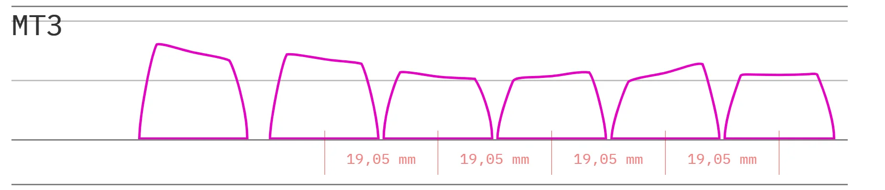

**Профиль клавиатуры** — это, простым языком, вид кейкапов сбоку. Сложным языком — это различия рядов кейкапов по углу наклона, высоте, форме контактной площадки.

Клавиши могут быть как низкопрофильные, а-ля клавиатуры Apple, так и высокопрофильные, как на старой печатной машинке. Первый вариант, благодаря своей эргономичности, распространен в ноутбуках. Второй вариант распространен среди механических клавиатур, и именно такие кейкапы представлены у нас на сайте. 

## ТИПЫ ПРОФИЛЕЙ КЛАВИАТУР

### **ИЗОГНУТЫЙ**

Чаще всего представлен в виде клавиатур с изогнутой печатной платой. Кейкапы при этом имеют одинаковый профиль, но располагаются эргономичней, благодаря чему ощущаются в печати комфортно. 

Пример подобной клавиатуры — IBM Model F

                          
  

### **СКУЛЬПТУРНЫЙ**

В данном случае профиль самой клавиатуры и ее платы — прямой. Кейкапы уже сделаны с учетом эргономики. Ряды отличаются между собой и имеют различный угол наклона. 

Очевидный минус такого профиля — невозможность установить нестандартную раскладку и просто перекинуть капы, не превратив клавиатуру в монстра из фильма "НЕЧТО". 

Пример клавиатур с подобным профилем — Leopold FC900

## ИЗВЕСТНЫЕ ПРОФИЛИ:

### OEM

Самый распространенный профиль. Установлен на большинстве клав и общепринят как "стандартный". 

### CHERRY

Профиль чем-то напоминает OEM, но при этом ниже и, субъективно, заходит большему количеству людей.

### MDA

Достаточно плоский, но при этом рельефный профиль. Нижний ряд выпуклый.  
  

### MT3

Ретроспективный профиль, вдохновленный **Signature Plastics SA.** Спроектировано с любовью.  
  

### SA

Олдскульный высокий профиль со сферическими углублениями из семейства **Signature Plastics.**

### KAT

Сферические, низкопрофильные, скульптурные кейкапы.

### DCS SIGNATURE PLASTICS

Еще один олдскульный профиль от **Signature Plastics.**

### ВИНТАЖНЫЙ APPLE MACINTOSH

Винтажные клавиатуры Apple (со стандартными механическими переключателями Alps SKCL / SKCM или Mitsumi) имеют специфичный для Apple профиль, который несовместим с другими производителями. 

### **ПЛОСКИЙ**

Собственно, название говорит само за себя. Ряды кейкапов не имеют наклона и легко взаимозаменяемы. Часто используется в ноутбучных и низкопрофильных клавиатурах.

Некоторые клавиши могут иметь углубления в верхней части для лучшей читаемости пальцами при слепой печати.

## ИЗВЕСТНЫЕ ПРОФИЛИ:

### DSA

Равномерный низкий профиль.

  

### XDA

Схожий с DSA профиль, при этом контактная площадка для пальца больше и комфортней.

  

### KAM

Профиль на основе скульптурного KAT. При этом контактная площадка шире, а профиль выше, чем у DSA.

  

### MBK

Кейкапы с эпически большой сферической контактной площадкой под низкопрофильные переключатели Choc.  
  

### **СТУПЕНЧАТЫЙ**

Профиль клавиатуры, который создает эффект наклона а-ля печатная машинка.

Ступенчатое строение было более типичным в 70—х и 80—х годах и использовалось в таких клавиатурах, как IBM Selectric Touch Keyboard, более известной как «Модель M2».

Все клавиши имеют одинаковый угол наклона. Если переключатели установлены в одной плоскости, то верхние поверхности кейкапов наклонены назад:

Как вариант — угловое расположение переключателей, позволяющее добиться эффекта ступенчатого профиля на плоских кейкапах:

## ИЗВЕСТНЫЕ ПРОФИЛИ:

### G20

Низкий профиль с большой контактной площадью и плавным переходом от одного кейкапа к другому.

  

### KT

Ну, профиль и профиль.

  

### **ЧИКЛЕТ**

Клавиши Chiclet — это низкопрофильные клавиши с прямыми сторонами, подходящими под отверстия в верхней части клавиатуры. Некоторые клавиатуры имеют углубление в середине клавиш. Пробел на клавиатуре chiclet обычно бывает плоским. 

Термин «чиклет» был придуман во время революции домашних компьютеров в конце 1970-х — начале 1980-х годов, нагло украден от названия конфеты «Чиклет», которую напоминали клавиши. Как жаль, что западные коллеги не имели доступа к ириске "Кис—кис", и мы не застали более экстравагантного названия.

Ранние клавиатуры chiclet (например, для ПК-младшего, Sinclair Spectrum и т.д.) имели клавиши в стиле калькулятора. Тогда они качались при нажатии, однако современные клавиатуры имеют устойчивые ножничные переключатели. Сейчас такой профиль можно встретить на многих новых ноутбуках и низкопрофильных клавиатурах.

  
Алюминиевая клавиатура Apple, одна из первых современных клавиатур chiclet

## ИЗВЕСТНЫЕ ПРОФИЛИ:

### APPLEMAG

Супернизкий профиль. 

  

