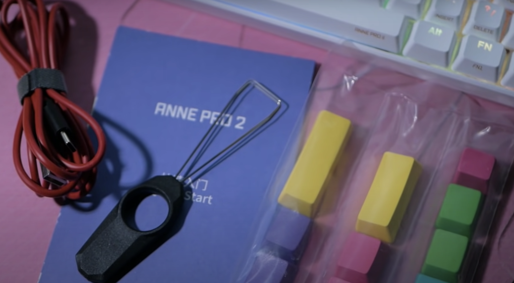
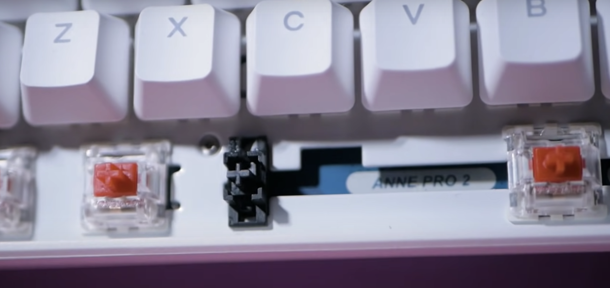
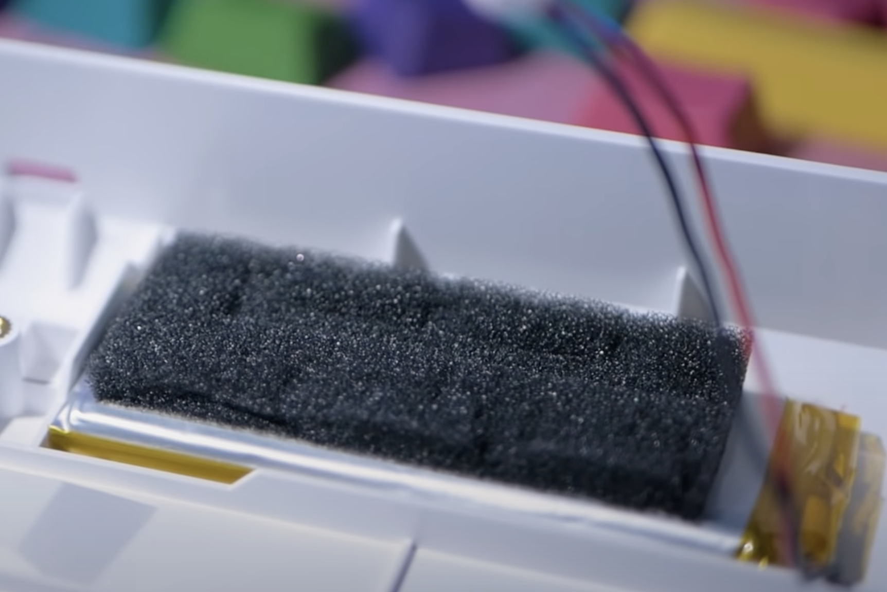
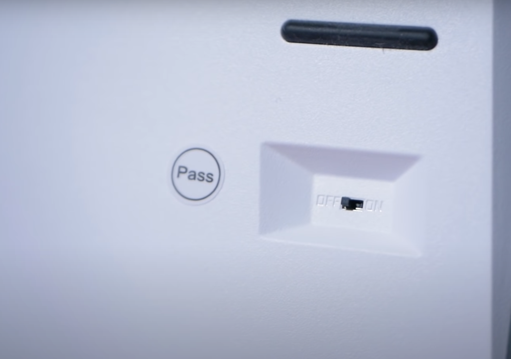
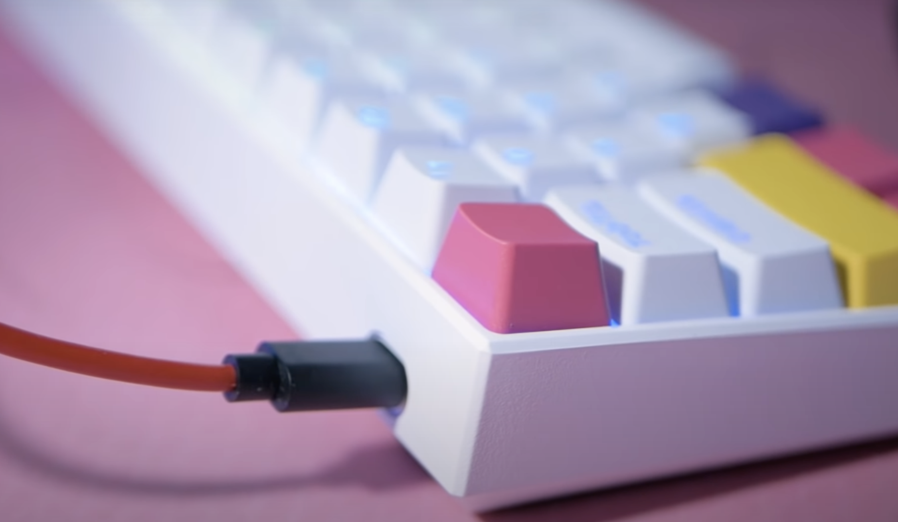
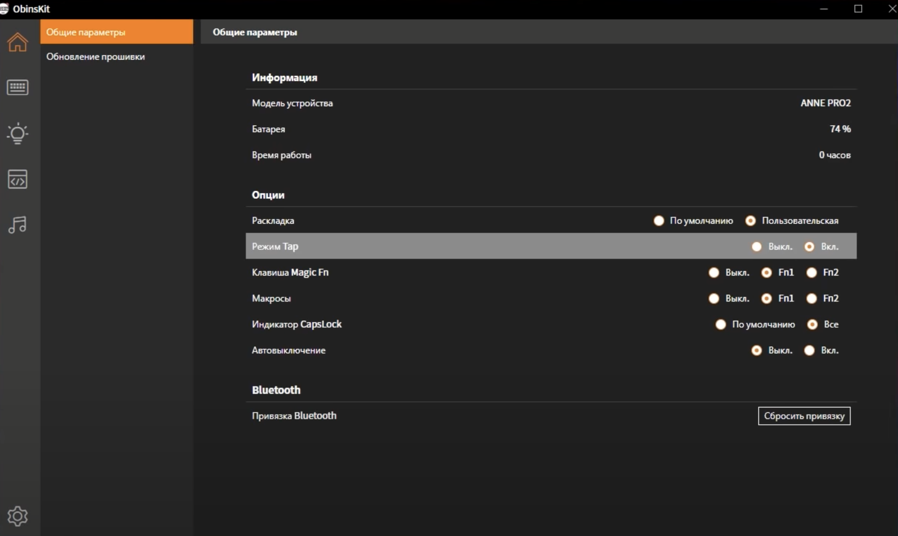
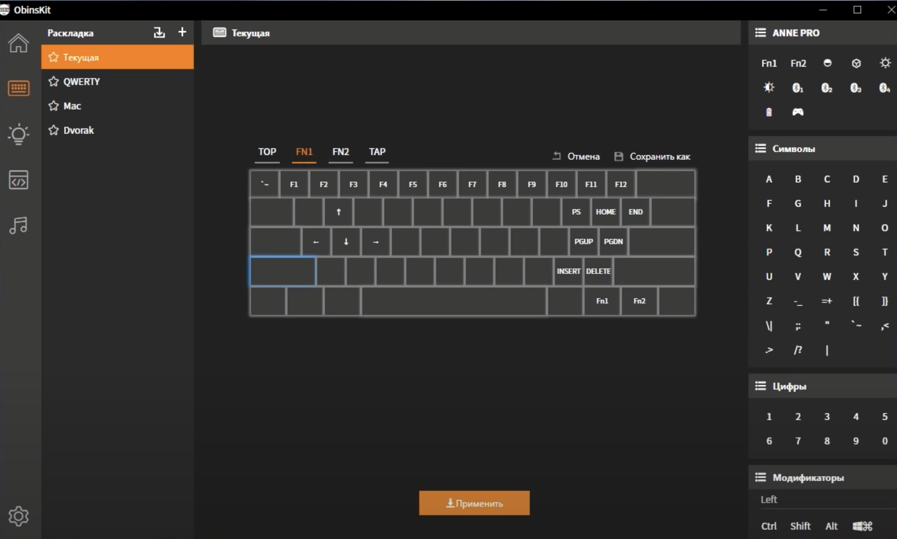
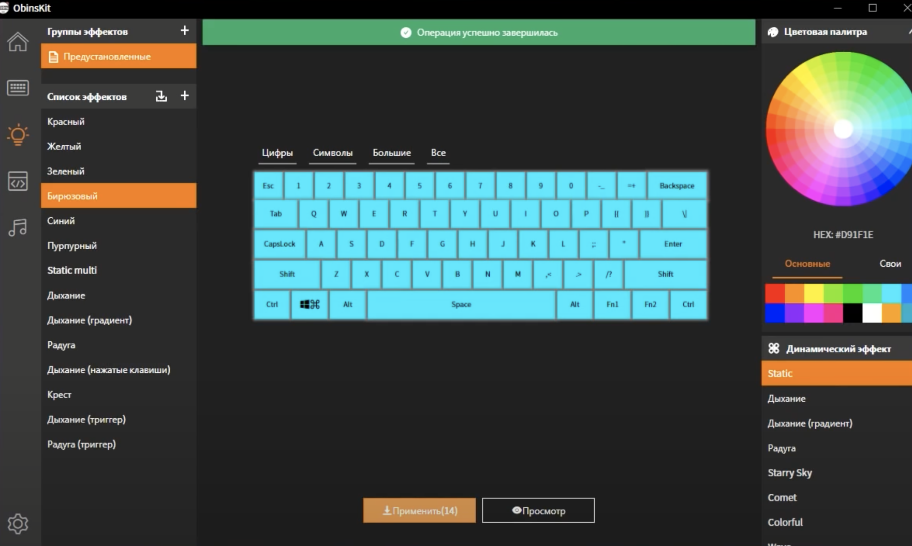

Это маленькая 60 процентная механическая клавиатура у которой PBT кейкапы классные и интересные переключатели и стабилизаторы смазаны с завода. Более того у этой клавиатуры полноценная rgb подсветка и еще она может подключаться по bluetooth. Это новый продукт от компании [Obinslab](https://www.hexcore.xyz/) **anne pro 2**

 Клавиатура стоит ни много ни мало 70 долларов, а что за эти деньги мы получаем в комплекте с девайсом помимо клавиатуры?
 
В коробке лежит:
 - краткий мануал 
 - красный usb type-c кабель для проводного подключения клавиатуры 
 - 11 сменных разноцветных PBT кейкапов 
 - проволочный puller 
 
 
 
В целом комплектация мне понравилось, особенно учитывая стоимость.

## Давайте сразу же определимся кому же нужна эта клавиатура?

Если вам нужен обязательно отдельный ряд f клавиш, а также отдельно стрелочки, отдельно цифровой блок, то эта клавиатура вам не подойдёт.

Если вы способны использовать сочетание клавиш, для того чтобы сохранить полный функционал этой клавиатуры, то смело берите данный борд. Да отдельного ряда f клавиш тут нет, и нет отдельного цифрового блока вместе со стрелочками. Нет их лишь только физически, программно они тут есть.

Другими словами эти клавиши присутствуют, но виде комбинации с одной из функциональных кнопок. Простое нажатие на кнопку будет обычным, а вот такой же нажатие на эту же кнопку, но при нажатой функциональной клавише может ввести любой запрограммированный вами символ или действие.

Все функции, режимы и даже макросы тут присутствуют, но для их использования придется постоянно зажимать одну дополнительную клавишу. Кстати все команды можно переназначить в специальном программном обеспечении о котором мы поговорим чуть позже.

## Что внутри данного борда?

В моем случае тут стоит классические красные механические Gateron, но вы можете взять эту клавиатуру также и на Kailh box или даже классические MX Cherry. Что касается красных Gateron он ход у них отменный. По ощущениям эффекта песка нет от слова совсем, ход стема максимально плавный, а его горизонтальный и вертикальный люфт минимален. Важно понимать что это механические, а не оптические Gateron и именно поэтому люфт штока незначительный.

Стабилизаторы тут Cherry подобные и самое главное, что они с завода имеют смазку, но смазаны они спустя рукава. По крайней мере у меня самой смазки в некоторых местах не хватает, а где-то очевидно есть лишняя. По опыту могу сказать что хорошая смазка со временем все равно проникает в стабы чуть глубже и поэтому tapping может хоть и незначительно, но все же станет приятнее. Даже с такой смазкой стабилизаторы не гремят, а пробел относительно тихий.

По кейкапам тут тоже круто, тут кейкапы из полибутилентерефталата, то есть PBT. Они выполнены по технологии двойного литья, а это значит лишь одно, что символы на этой клавиатуре никогда не сотрутся. По ощущениям кажется что это не чистый PBT, а смесь PBT и ABS пластика в соотношении 80/20, но точной информации об этом нет.

Профиль стоковых кейкапов OEM и в сочетании с углом самого корпуса в 7,5 градуса говорит нам о том что кому-то может потребоваться дополнительная подставка под запястья. В комплекте таковой не предусмотрено.

Раскладка тут стандартная ANSI с длинными шифтами и одноуровневым Enter. К шрифту претензий нет, подсвечивается равномерно да и выглядит более чем уместно, но имейте ввиду что у вас может оказаться видоизменённый шрифт так как от экземпляра к экземпляру он чуть изменяется,

Толщина стенок кейкапа около одно миллиметра и в целом это нормально. Дополнительные комплектные клавиши отличаются от стоковых лишь цветом и отсутствием каких-либо символов.

Порадовал меня и корпус, несмотря на то что выполнен он из ABS пластика клавиатура ощущается в руках как монолитный брусок. Все благодаря толщине этого пластика в два с лишним миллиметра. В совокупности с полуторамиллиметровой металлической пластиной в основании, клавиатура не издает ни единого звука при попытке скручивания. Деформировать или сломать будет ее достаточно затруднительно.

Кстати, из-за того что бока кейса расположены на восемь миллиметров выше металлической пластины в которую вмонтированы свитчи, то строение у нее получается закрытое. Никакого скелетона вы тут не увидите.

Дизайн клавиатуры дополняют срезанные снизу грани, благодаря такому решению она смотрится отлично.

Внутри корпуса расположена аккумуляторная батарея на 1900 миллиампер/час, которая обеспечивает беспроводную работу данного устройства, Этого хватает до 9 часов работы. Результаты не впечатляют, но что ожидать от подобной батареи.

Круто что сам аккумулятор сверху имеет виброзащиту, это сделано для того:

- Чтобы батарея плотнее прилегала к корпусу
- Защита от повреждения той же платой так как в некоторых местах припой бывает очень острый

Снизу клавиатуры вы найдете 4 прорезиненные ножки которые не выдвигаются, но с учетом наклона самой клавы это и не нужно. Далее тут есть переключатель на беспроводное соединение и логотип Anne pro.

Беспроводное подключение поддерживает до 4 устройств. Переключение между ними осуществляется при помощи нажатия клавиши function и цифры от 1 до 4.

Подключить можно хоть ваш смартфон, главное чтобы bluetooth был не ниже 4 версии.

Стандартный кабель длиной 1,8 метра. Он без тканевой оплетки да она и не нужна поскольку кабель относительно мягкий и красный цвет отлично вписывается в общий дизайн борда.

Программное обеспечение клавиатуры конечно же на месте иначе как переназначить клавиши. Интерфейс программы интуитивно понятен. Регулярно прилетают обновления, что означает лишь одно - производитель постоянно следит за отзывами и фиксит существующие баги.

На главной странице мы увидим информацию об уровне заряда аккумулятора, о раскладке и дополнительных функциональных режимах. Во вкладке Layout мы можем самостоятельно настроить раскладку и переназначить клавиши. Следующая вкладка отвечает за различные режимы подсветки Тут их огромное количество и можно создать собственный пресет.

##  Итог 

По итогу клавиатура мне понравилась особенно учитывая ее стоимость. Сравнивать ее с [GK61](/posts/opto-mekhanicheskaya-klaviatura-gk61-s-aliexpress/) нет смысла так как эти клавиатуры абсолютно разного качества и разного ценового сегмента. Рекомендую ли я Anne Pro 2 к покупке - однозначно да. Это уже законченный продукт который купил и пользуешься. Конечно ты можешь разобрать ее, проложить шумку и смазать свитчи и стабы. Тогда данная клавиатура станет более идеальной.

