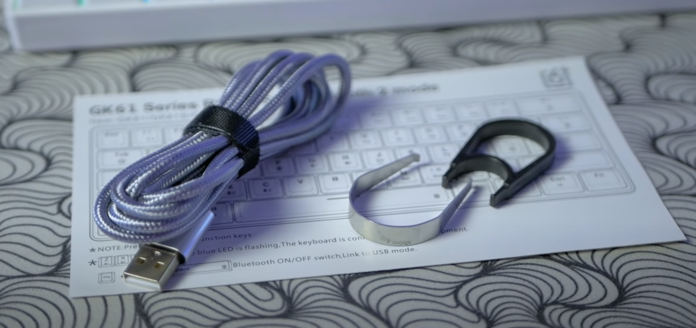
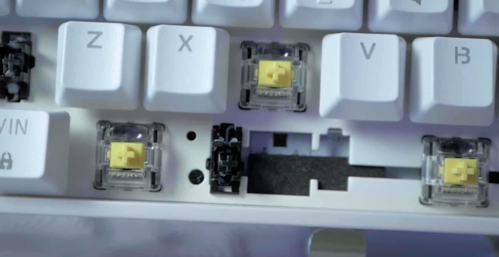
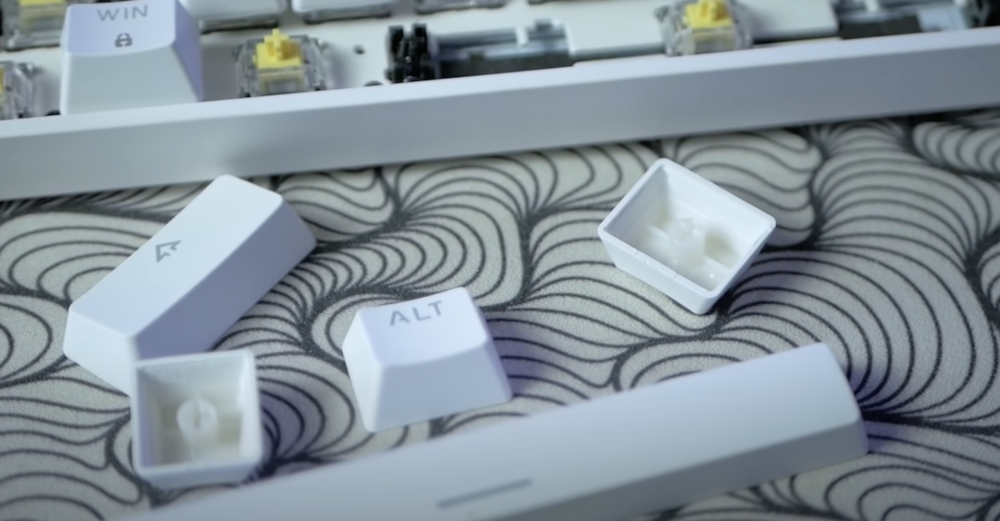

Привет всем. Мне тут на днях попалась на глаза обновленная версия клавиатуры GK61 от  Skyloong за 40 долларов, так давайте о ней и поговорим. Что в ней хорошего и стоит ли ее покупать?
 
 ##  Что внутри поставки? 
 
 Давайте сначала посмотрим что внутри коробки. Тут не каких сюрпризов. 
 Мы имеем саму клавиатуру, кабель для соединения с компом, дешевый пластиковый пуллер для снятия кейкапов, металлический пуллер для снятия свичей, ну и инструкция. Надо отдать должное, что данной версии поставки  кабель в приятной тканевой оплетке.

Комплект довольно скромный, но что можно ожидать от продукта за 3000 рублей. Доехала клавиатура довольно быстро дней 10, без каких-либо проблем. 
 
## Внешний вид 

Что тут сказать внешний вид соответствует цене. Все довольно стандартно, нет вычурных решений, все достаточно прозаично для геймерской тематики. Существует две расцветки: 
- классическая черная 
- обновленная белая 

По строению клавиатура закрытого типа, то есть переключатели прикрыты пластиковыми бортами кейса. Все весьма органично. Разъем usb-c находится с левой стороны на задней части корпуса. 
 
Форм-фактор  данного девайса не самый стандартный - 60 процентов. Или другими словами  в ней нет f-клавиш, стрелок и цифрового блока, то есть максимально компактно.  Раскладка ANSI: Shiftы длинные, Enter одноуровневый, ряд f клавиш и остальные отсутствующие клавиши реализованы при помощи комбинации кнопок. Надо отметить что такой форм-фактор подойдет далеко не всем, хотя есть и фанаты такого формата в том числе и я. 
 
##  Что внутри 
 
В основе данного устройства стоят оптические переключателю от Gateron. Такие переключатели безусловно долговечны, так как нет контактов внутри самого свича которые замыкается. Правда есть несколько недостатков. 
1. Несмотря на то что клавиатура предоставляет функцию горячей замены переключателей, но вы можете их поменять только на аналогичные оптические. Механические переключатели сюда не подойдут. 
2. Шатание стэма, особенно горизонтальное, тут куда больше чем на механических. Да и в своих посадочных местах они шатаются.  

Само нажатие плавное, эффекта песка у оптики практически не бывает, опять же если мы говорим про линейное исполнение.

В моей клавиатуре стоят желтые Gateronы, по факту они похожи на красные. Основное отличие это уменьшенная сила нажатия до 35 грамм. Они действительно приятнее нажимаются чем стандартные реды, но тут все зависит личных предпочтений.

Со стабами тут лотерея, кому-то они приходят полностью смазанные  с завода, а кому-то как мне. Тут смазки можно сказать что нет, так что мне пришлось слегка доработать девайс: проложить шумку и смазать стабы.

Про стабилизаторы и переключатели вроде более или менее понятно, теперь давайте поговорим про кейкапы. Тут стоят бюджетные кейкапы из ABS пластика, толщиной более одного миллиметра, но на удивление они не вызывают отвращения другие масс маркет решения.

Возможно из-за технологии двойного литья при которой нанесенные символы никогда не сотрутся, а возможно просто из-за качественного ABS пластика. 

Клавиши тут достаточно бюджетные, если для вас это первая клавиатура, то можно и поработать на них пару месяцев, а там уже  и моддинг не за горами.

Внизу стоят четыре прорезиненные ножки без регулировок. Хотя для меня стоковый наклон достаточно удобен для работы и игр. 

Приятно что за 3000 рублей вы получаете также программное обеспечение, что позволит вам переназначить клавиши, записать макросы и настроить подсветку тем более она тут RGB.

## Итог 

Исходя из небольшой цены борд получился неплохой, хотя и не идеальный  Покупать или нет тут однозначного ответа нет, но что вы получаете: 
- Hot-swap переключатели
- Правда оптические ))) 
- Программное обеспечение для настройки 
- Смазанные стабилизаторы (правда бывают исключения) 

Если у вас есть время и желание, то вы всегда можете его доработать: смазать стабы и проложить шумку. Возможно тогда все станет лучше