Формат клавиатуры – это ее размер, количество и расположение клавиш (раскладка). Подавляющее большинство клавиатур использует либо американскую раскладку ANSI, либо европейскую ISO. Казалось бы, разница между ними не очень велика, но даже эти небольшие различия могут причинить настоящие мучения, когда вы работаете не на той раскладке, к которой привыкли. 

## **ОТЛИЧИЯ МЕЖДУ ФОРМАТАМИ ANSI И ISO**

### **ENTER**

В ANSI он вытянутый, в ISO – высокий, на два ряда.

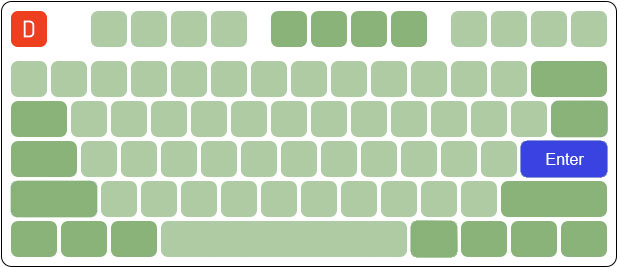

_Enter в раскладке ANSI_

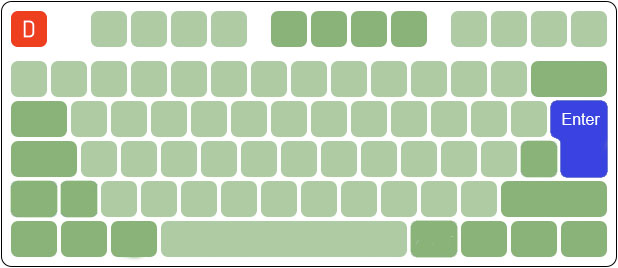
 
 
 _Enter в раскладке ISO_
 

### **SHIFT**

В ANSI оба шифта длинные, в ISO левый Shift короткий.

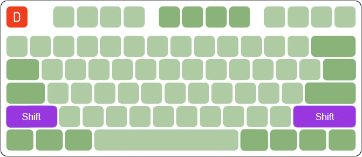

_Shift в раскладке ANSI_

 
 
 _Shift в раскладке ISO_

### **БЭКСЛЕШ**

В ANSI он чуть длиннее стандартной клавиши и размещен над Enter. В ISO бэкслеш короткий, расположен рядом с левым Shift. А рядом с Enter может быть расположен как второй бэкслеш, так и другая клавиша — например, тильда.

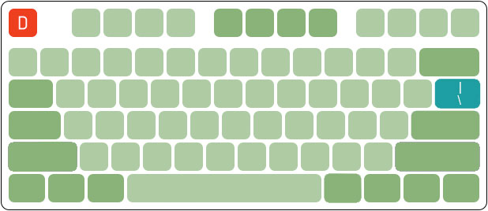

_Бэкслеш в раскладке ANSI_

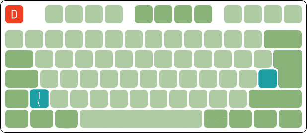

_Бэкслеш в раскладке ISO_

###   **ALT**

В ANSI оба Alt равнозначны по функциям, а в ISO правый обозначен как Alt Gr и используется для ввода дополнительных символов расширенных раскладок европейских языков.

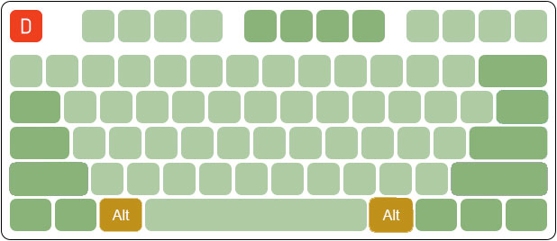

_Alt в раскладке ANSI_

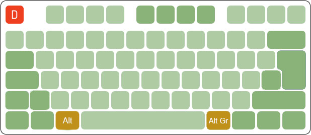

_Alt в раскладке ISO_

## КЛАССИЧЕСКИЕ ANSI И ISO ФОРМАТЫ КЛАВИАТУР (104-109 КЛАВИШ, 100%)

Клавиатуры классического формата содержат 104 клавиши (ANSI) или 105 (ISO), но множество моделей отходят от этого стандарта. Разработчики идут двумя путями: сокращение набора клавиш и более плотное их расположение в компактных моделях и введение дополнительных специальных клавиш в многофункциональных моделях.

104/105-клавишный стандарт вполне удобен, но в нем оставлено пустое место над цифровым блоком. Кто-то помещает туда логотип производителя, но часто туда устанавливают несколько полезных дополнительных клавиш для управления мультимедийными функциями, либо для запуска часто использующихся приложений. Всего клавиш получается уже 108 или 109, при этом клавиатура не увеличивается в размере относительно стандартной.  
  
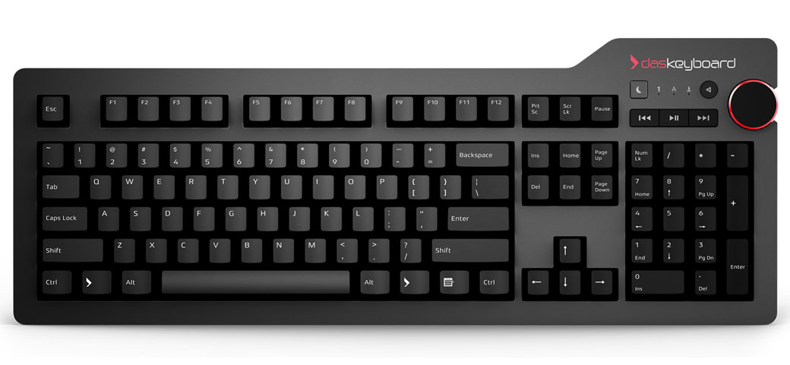  
_Механическая клавиатура Das Keyboard 4 Professional. 104 основные клавиши + 6 дополнительных медиа-клавиш (ANSI)._

## **МАКРОКЛАВИАТУРЫ**

Макроклавиатуры ориентированы, в основном, на применение в компьютерных играх. В них слева от основного блока клавиш размещают дополнительный блок для записи и воспроизведения клавиатурных последовательностей – макросов. За счет этого они заметно шире классических. Полезны не только геймерам, но и программистам, да и всем, кто вынужден тратить время на ввод одних и тех же текстовых конструкций.  
  
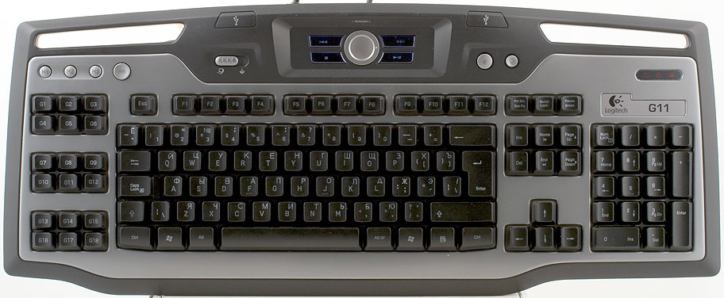  
_Механическая клавиатура Logitech G11 (ISO)._

## **КЛАВИАТУРЫ БЕЗ ЦИФРОВОГО БЛОКА (TENKEYLESS, TKL, 80%)**

Укороченные tenkeyless клавиатуры содержат 87 клавиш (80%) и не имеют цифрового блока, в остальном аналогичны классическим. Если вам не приходится набирать большие числовые последовательности, то этот блок вам и не нужен, зато без него справа от клавиатуры освобождается много места, и руке с мышью становится гораздо вольготнее.

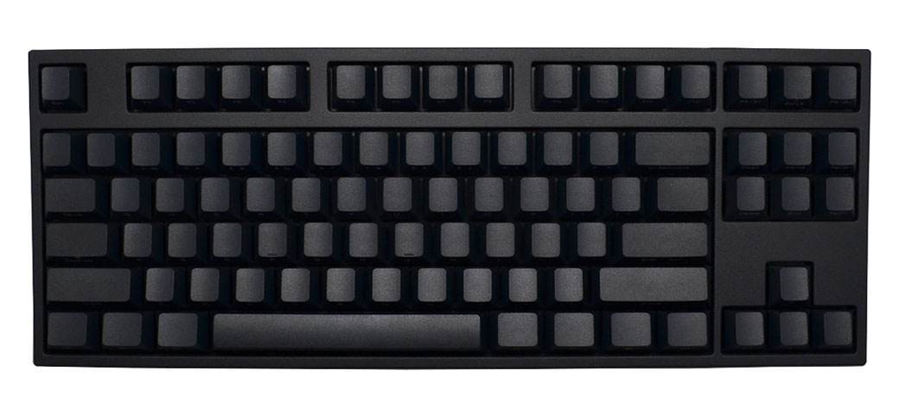  
**_Механическая клавиатура Leopold FC750R Tenkeyless. 87 основных клавиш + 3 дополнительных (ANSI)._**

## **КЛАВИАТУРЫ 75%**

**75%** – чуть более компактный формат. Мало того, что в них нет цифрового блока, остальные клавиши расположены плотно, без свободного пространства – стрелки и системные команды (ScrLock, NumLock, Pause/Break) втрамбованы в основной блок. Места для мыши еще больше, но работать менее удобно, чем в укороченном формате.

  
_Механическая клавиатура Vortex Race II. 75% (ANSI)._

## **КЛАВИАТУРЫ 60-65%**

**60%** – компактные клавиатуры. У них нет функциональных клавиш F1-F12, отрезан цифровой блок, убраны стрелки и блок системных команд. Все это заменено комбинациями нажатий.

Размер **65%** отличается от 60% наличием стрелок и еще двух-трех клавиш системных команд. В обоих форматах выпускаются преимущественно портативные, носимые клавиатуры.  
  
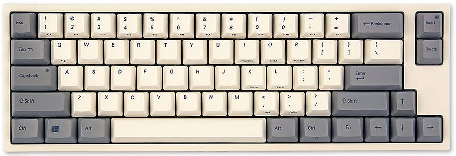   
_Механическая клавиатура Leopold FC660C с переключателями Topre. 65% (ANSI)._

## **КЛАВИАТУРЫ 40%**

**40%** – суперкомпактный формат для настоящих хакеров. В нем нет еще и верхнего ряда цифровых клавиш. Чтобы ввести цифры, нужно зажать Fn или переключиться на специальную раскладку, где вместо букв – цифры и разные спецсимволы. Этот формат применяется исключительно для ультрапортативных клавиатур и популярен среди самых суровых гиков.

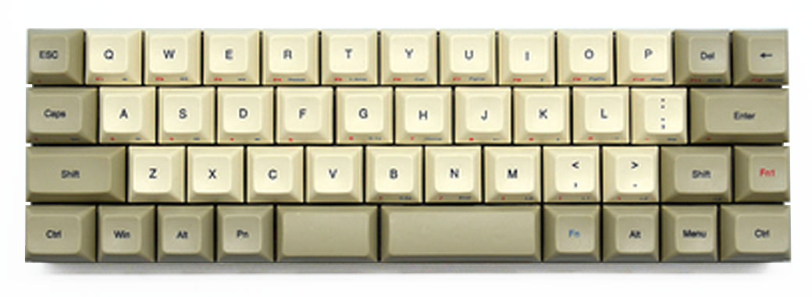  
_Механическая клавиатура Vortex Core._

## **ЭРГОНОМИЧНЫЕ КЛАВИАТУРЫ**

**Эргономичные клавиатуры** призваны облегчить многочасовую работу за компьютером за счет обеспечения естественных положений рук при наборе текста. Посмотрите, как лежат ваши руки на обычной клавиатуре – кисти постоянно находятся под углом к предплечьям. Это не полезно и может привести к весьма болезненному синдрому запястного канала. Ради борьбы с этим явлением разработчики эргономичных клавиатур делают излом посередине основного блока клавиш, либо делят его на две разнесенные и наклоненные части.
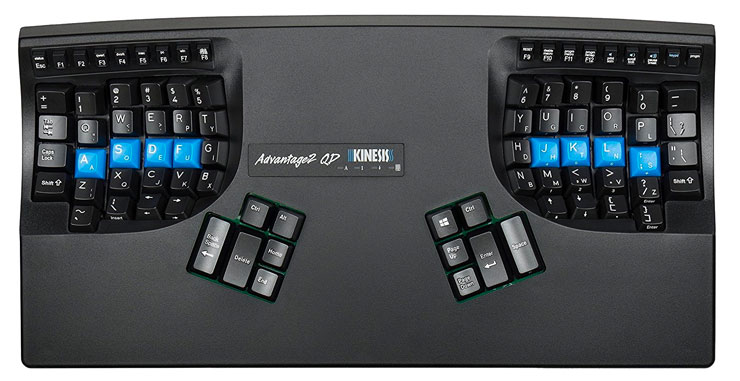  
_Эргономичная механическая клавиатура Kinesis Advantage 2._

## **РАЗДЕЛЬНЫЕ КЛАВИАТУРЫ**

**Раздельные клавиатуры** – дальнейшее развитие идей эргономичных клавиатур. Они разделены на независимые две части примерно поровну так, чтобы каждая рука лежала на своей половине и нажимала только на свои клавиши. Независимость двух половин дает полностью свободное положение рук при наборе текста.
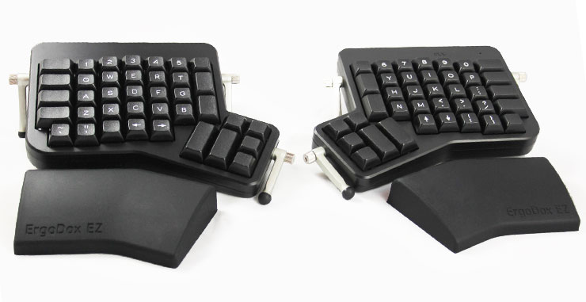  
_Эргономичная механическая клавиатура ErgoDox._

## **КЕЙПАДЫ**

**Кейпады** – специализированные мини-клавиатуры, предназначенные для использования в играх, где различные команды можно давать не через меню, а напрямую, назначив их на клавиши. Все клавиши кейпадов программируемые и расположены в пределах досягаемости пальцев одной руки. Во многих играх кейпад позволяет обойтись без основной клавиатуры, в других он — полезное дополнение к ней.  
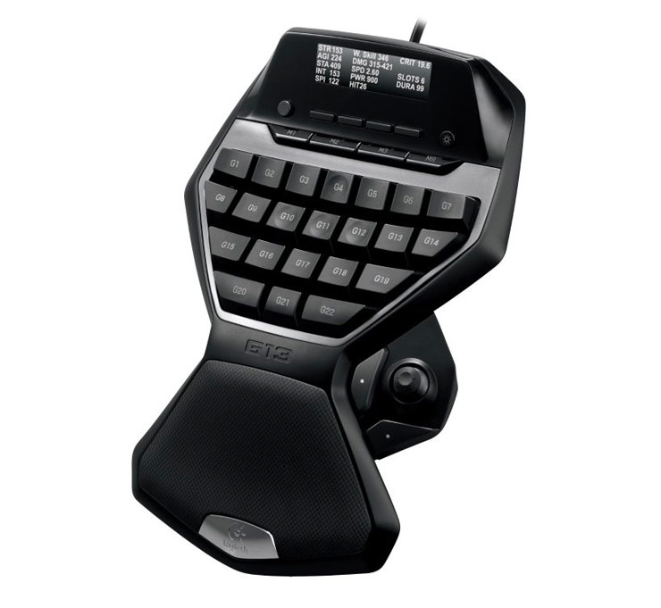  
_Кейпад Logitech G13._