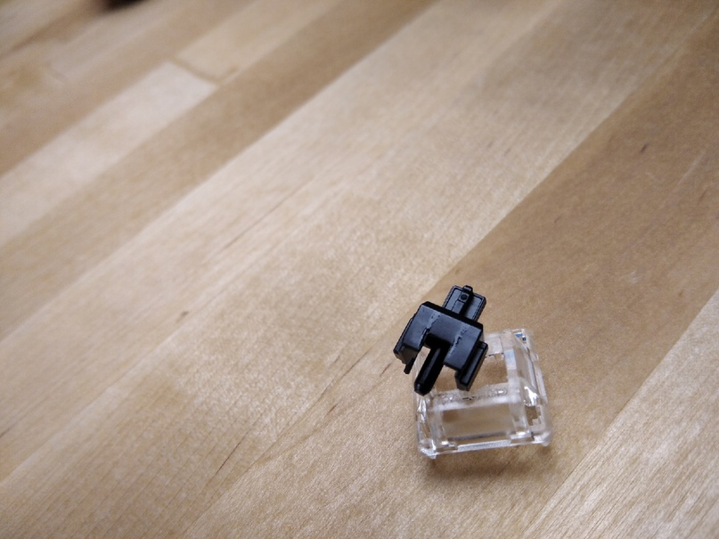

## **ЗАЧЕМ НУЖНА СМАЗКА?**

В процессе погружения в мир клавиатур рано или поздно сталкиваешься с такой модификацией как _"смазка клавиатуры"_. Естественно, на первых порах возникают вопросы:

-   Как?
-   Зачем?
-   Что такое этот ваш крайтокс?
-   Почему клавиатуру, которая стоит как зарплата в Ивановской области, нужно еще и смазывать?

Начнем с последнего. В клавиатуре есть механизмы, которые состоят из пластика, пружин, металлических скоб и контактов. Исходя из этого, работа устройства проходит с целым спектром лязгов, звонов, цоканий и прочих приятных звуков. Таких механизмов в клавиатуре два — стабилизаторы и переключатели. В первую очередь смазка убирает именно эти паразитные звуки.

На этом плюсы не заканчиваются. Никакое видео не передаст, как сильно повышается именно тактильный комфорт от печати. Импакт, тайпинг, можно называть как угодно. Если попробовать передать словами, то это как разница между оригинальными дорогими кроссовками и их репликой. Выглядят они одинаково, но в первом случае будет ощущение, что вы парите. Так же и с клавиатурой, пальцы будут словно парить над клавишами и утопать в маслянистом гладком ходу переключателей и стабов.

Для тех, кто хотел увидеть тут слова об эффекте песка при нажатии в переключателях Cherry — да, его смазка так же частично убирает

## **ПОЧЕМУ КЛАВИАТУРА НЕ СМАЗАНА ЗАРАНЕЕ?**

На самом деле, это распространенное заблуждение. Многие свитчи, в том числе и Cherry, смазаны с завода. Вот только количество смазки там минимальное. Пока что лучшие умы Китая не придумали, как смазывать свитчи круто, равномерно и не вручную. Собственно, массовое производство качественно смазанных свитчей организовать можно, но тогда наши любимые клавиатуры заметно прибавят в цене.

Стабилизаторы же — наоборот, смазать на порядок проще. Например, у таких фирм, как Varmilo и Durgod, с завода все звучит прекрасно. 

  
Несчастные следы смазки на свитчах Cherry

## КАКИЕ СМАЗКИ БЫВАЮТ?

Смазок, на самом то деле, в природе полно — силиконовые, восковые, тефлоновые, durex на водной основе, но нас интересуют два типа:

-   Тефлоновые, для смазки переключателей — Krytox, Trybosis.
-   Силиконовые, для смазки стабилизаторов — Permatex, SuperLube.

**Какую смазку использовать?**

Мы используем более распространенные Permatex и Krytox, но в краткой сводке расскажем и о других смазках. Принцип простой: более жидкие варианты лучше подойдут для переключателей, а в стабилизаторах нужна более вязкая смазка, что позволит сильно уменьшить звук удара скобы о стенки хаузинга и убрать "раттлинг".

**Krytox 205g0**

-   Консистенция: горчица, средней вязкости
-   Внешний вид: белый маслянистый крем
-   Куда мажем: пружина, стем, нижний хаузинг свитча
-   Рекомендуется для: переключателей
-   Сложность нанесения: средняя

**Krytox 205g2**

-   Вязкость: арахисовая паста, очень вязкая
-   Внешний вид: белый плотный крем
-   Куда мажем: пружина, стем, нижний хаузинг свитча и хаузинг стаба
-   Рекомендуется для: переключателей, стабилизаторов
-   Сложность нанесения: высокая

**Krytox 105g0**

-   Вязкость: оливковое масло, низкая вязкость
-   Внешний вид: прозрачное масло
-   Куда мажем: пружина свитча
-   Рекомендуется для: пружин переключателей
-   Сложность нанесения: низкая

**Permatex**

-   Вязкость: высокой вязкости
-   Внешний вид: полупрозрачный крем
-   Куда мажем: скоба стабилизатора
-   Рекомендуется для: стабилизаторов
-   Сложность нанесения: средняя

**SuperLube**

-   Вязкость: высокой вязкости
-   Внешний вид: полупрозрачный крем
-   Куда мажем: скоба стабилизатора
-   Рекомендуется для: стабилизаторов
    

**TriboSys 3204**

-   Вязкость: средне-высокая 
-   Внешний вид: белый плотный крем
-   Куда мажем: пружина, стем, нижний хаузинг свитча   
-   Рекомендуется для: переключателей
    

**TriboSys 3203**

-   Вязкость: средняя
-   Внешний вид: белый маслянистый крем
-   Куда мажем: пружина, стем, нижний хаузинг свитча
-   Рекомендуется для: переключателей
    

## **КАК НАНОСИТЬ СМАЗКУ?**

Тут все достаточно просто: вы можете взять либо один из готовых проверенных гайдов, что отлично подойдет для новичков, либо изобретать колесо. Благо тут есть где разгуляться, ни один мануал не претендует на звание единственного расово верного, а смазки расположены к тому, чтобы их смешивали, по-разному наносили и вообще изгалялись как только захочется. Главное, помните, что под эксперименты лучше отдельно выделить детали и тестировать сразу же после нанесения, а не смазав всю клавиатуру.
